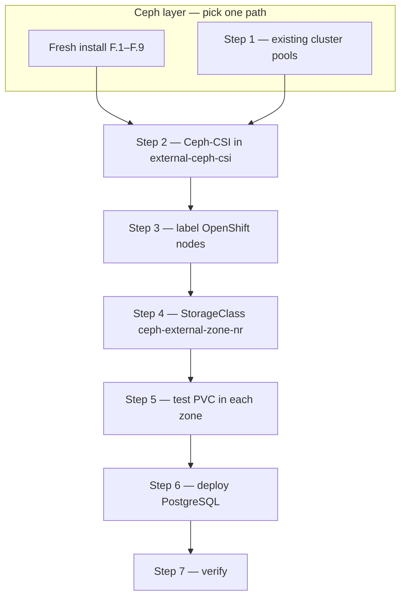

# External Ceph cluster — fresh install or existing

Deploy or reuse an **external Ceph cluster** for **zone-local RBD** on OpenShift via `rbd.csi.ceph.com`.

Use this guide when ODF cannot provision per-zone pools (e.g. `flexibleScaling: true`) — see [`exchange/SOLUTION-ZONAL-RBD.md`](exchange/SOLUTION-ZONAL-RBD.md).

| Path | When | Start here |
|------|------|------------|
| **Fresh install** (recommended) | No Ceph yet — 3 dedicated Linux nodes | [F.1](#f1-prepare-all-three-nodes) |
| **Existing Ceph** | Separate Ceph cluster already running — not recommended on ODF-shared Ceph unless you accept CRUSH change risk | [Step 1](#step-1--ceph-per-zone-pools-on-an-existing-cluster) |

> **Recommendation**  
> For zone-local RBD when ODF non-resilient pools are unavailable, **prefer a fresh install** on three dedicated storage nodes. You get zone topology and per-zone pools (F.6–F.7) without touching ODF or redeploying OpenShift Data Foundation.  
> Use the **existing-cluster** path only when you already operate an independent Ceph cluster with spare capacity — not as a shortcut to add pools on the same Ceph mons ODF uses unless you have tested CRUSH changes in non-production.

Both paths merge at **[Step 2](#step-2--deploy-ceph-csi-separate-from-odf)** (CSI on OpenShift) and follow the same Steps 3–7.

---

## End-to-end roadmap



| Step | Where | What you do | Done when |
|------|-------|-------------|-----------|
| **F.1–F.9** or **1** | Ceph nodes | Per-zone pools `rbd-zone-a/b/c`, CSI user, mon IPs | `ceph osd pool ls` shows three pools; mon IPs noted |
| **2** | OpenShift | Namespace, secret, Ceph-CSI, ConfigMap, SCC | `oc get csidriver rbd.csi.ceph.com`; CSI pods Running |
| **3** | OpenShift | `topology.kubernetes.io/zone` on workers | `oc get nodes -L topology.kubernetes.io/zone` |
| **4** | OpenShift | Apply StorageClass | `oc get sc ceph-external-zone-nr` |
| **5** | OpenShift | Test PVC + pod per zone | PVC Bound in correct zone |
| **6** | OpenShift | Deploy pg-multizone PostgreSQL | 3 postgres pods Running |
| **7** | OpenShift | Run verify scripts | Pods spread zone-a/b/c |

**Estimated time (lab):** fresh install ~2–3 h · existing cluster ~45 min · OpenShift steps ~30 min.

---

## When to use this guide

| Situation | Use this guide? |
|-----------|-----------------|
| **No Ceph yet** — dedicated storage nodes | **Yes** — [fresh install](#fresh-install--ceph-on-3-linux-nodes) (**recommended**) |
| ODF `flexibleScaling: true`, `failureDomain: host` | **Yes** — [fresh install](#fresh-install--ceph-on-3-linux-nodes) preferred; [existing cluster](#step-1--ceph-per-zone-pools-on-an-existing-cluster) if you already have separate Ceph |
| ODF non-resilient pools already work | **No** — use [`ZONE-LOCAL-RBD.md`](runbooks/openshift/ZONE-LOCAL-RBD.md) with `cephrbd-multizone-nr` |
| Greenfield ODF with zone topology | Prefer native ODF NR pools over a second CSI driver |

---

## Before you start — collect these values

Fill this in as you work; you need every row before Step 2.

| Value | Example | Where to get it |
|-------|---------|-----------------|
| Monitor IPs (`:6789`) | `192.168.1.11:6789,192.168.1.12:6789,192.168.1.13:6789` | F.8 or Step 1.5 — `ceph mon dump` |
| Zone names | `zone-a`, `zone-b`, `zone-c` | Must match OpenShift node labels **and** CRUSH buckets |
| Pool names | `rbd-zone-a`, `rbd-zone-b`, `rbd-zone-c` | F.7 or Step 1.3 |
| CSI Ceph user | `client.csi-rbd-external` | F.8-alt or Step 1.4 |
| CSI user key | `(secret)` | `ceph auth get-key client.csi-rbd-external` |
| `clusterID` in ConfigMap | `ceph-external` | Fixed in this guide — keep consistent with StorageClass |
| StorageClass name | `ceph-external-zone-nr` | [`manifests/storageclass-ceph-external-zone-nr.yaml`](runbooks/openshift/manifests/storageclass-ceph-external-zone-nr.yaml) |
| Ceph version | `20.2.x` Tentacle (example) | F.2 — latest Tentacle patch from [download.ceph.com](https://download.ceph.com/); confirm with `ceph version` after bootstrap |

---

## Architecture

**Existing Ceph (shared with ODF):**

```
┌─────────────────────────────────────────────┐
│  Existing Ceph (shared with ODF)            │
│  ├── ocs-storagecluster-cephblockpool       │  ← ODF driver (unchanged)
│  └── NEW: rbd-zone-a / -b / -c (size 1)     │  ← External CSI (zone-local)
└─────────────────────────────────────────────┘
```

**Fresh install (3 dedicated Linux nodes):**

```
┌─────────────────────────────────────────────┐
│  New Ceph cluster (ceph-node1/2/3)          │
│  rbd-zone-a / rbd-zone-b / rbd-zone-c       │  ← Created in F.7
└─────────────────────────────────────────────┘
```

**Common OpenShift layer:**

```
          ▲ TCP 6789 (mons)
┌─────────────────────────────────────────────┐
│  Namespace: external-ceph-csi               │
│  Driver: rbd.csi.ceph.com                   │
│  StorageClass: ceph-external-zone-nr        │
└─────────────────────────────────────────────┘
          ▲
┌─────────────────────────────────────────────┐
│  OpenShift — topology.kubernetes.io/zone    │
└─────────────────────────────────────────────┘
```

**Principles**

- Do **not** modify ODF pools or the `openshift-storage` namespace.
- Add **new, empty** RBD pools and a **separate** CSI deployment.
- Pick the StorageClass per workload (`openshift-storage.rbd.csi.ceph.com` vs `rbd.csi.ceph.com`).

---

## Pre-flight checks

Run **before** changing Ceph or OpenShift.

### On OpenShift

```bash
oc whoami
oc get nodes
oc get csidriver openshift-storage.rbd.csi.ceph.com   # ODF — leave as-is
```

### On Ceph (existing cluster) or after fresh install

```bash
ceph -s                    # HEALTH_OK or documented HEALTH_WARN
ceph osd tree              # hosts under zone-a / zone-b / zone-c
ceph osd pool ls | grep rbd-zone
```

### Network — from an OpenShift worker

```bash
# Replace with your monitor IPs
for ip in 192.168.1.11 192.168.1.12 192.168.1.13; do
  nc -zv "$ip" 6789 || echo "FAIL: $ip:6789"
done
```

| Item | Requirement |
|------|-------------|
| Access | `cluster-admin` on OpenShift; `ceph` CLI on a monitor/admin node |
| Ceph | Healthy cluster; monitors reachable from all workers on port **6789** |
| Topology | ≥ 3 zones with OSDs (or one OSD host per zone in lab) |
| Nodes | Labelled `topology.kubernetes.io/zone` — [Step 3](#step-3--label-openshift-nodes) |
| Change window | CRUSH edits on existing clusters — back up first; validate in non-prod |

---

## Fresh install — Ceph on 3 Linux nodes

> **Skip this section if you already have a Ceph cluster** (e.g. shared with ODF). Go to [Step 1](#step-1--ceph-per-zone-pools-on-an-existing-cluster), then continue at [Step 2](#step-2--deploy-ceph-csi-separate-from-odf).

Deploy a **standalone Ceph cluster** on three Linux hosts with zone topology from day one. OpenShift connects via Ceph-CSI in Step 2 — no ODF required on the storage nodes.

> **Recommended release:** [**Tentacle**](https://docs.ceph.com/en/tentacle/) (Ceph 20.x) — the current stable major release for fresh deployments. F.2 installs the latest Tentacle patch from [download.ceph.com](https://download.ceph.com/).

### Lab topology

| Node | Example hostname | Zone label | Role |
|------|------------------|------------|------|
| 1 | `ceph-node1` | `zone-a` | Monitor + OSD + MGR |
| 2 | `ceph-node2` | `zone-b` | Monitor + OSD + MGR |
| 3 | `ceph-node3` | `zone-c` | Monitor + OSD + MGR |

```
zone-a (ceph-node1)     zone-b (ceph-node2)     zone-c (ceph-node3)
     │                        │                        │
     └──────────── Ceph cluster network ───────────────┘
                              │
                    OpenShift workers (separate nodes)
                    reach mons on TCP 6789
```

> OpenShift and Ceph nodes **may** be the same hosts in a tiny lab; production should use dedicated storage servers with separate OSD disks.

### Node requirements

Aligned with [Ceph Tentacle OS recommendations](https://docs.ceph.com/en/tentacle/start/os-recommendations/) and the [platform matrix](https://docs.ceph.com/en/latest/start/os-recommendations/). Use the **same OS major version on all three nodes**.

| Distribution | Version | Tentacle (20.2.z) | Notes |
|--------------|---------|-------------------|-------|
| **RHEL** | 9.x | Package + container host | `dnf` path in F.2 |
| **Rocky Linux** | 9.x | Container host | `dnf` or universal F.2 path |
| **Rocky Linux** | 10.x | Package + container host (≥ **20.2.2**) | `dnf` path in F.2 |
| **Ubuntu** | 22.04 LTS | Package + container host | Universal F.2 path; Podman |
| **Ubuntu** | 24.04 LTS | Container host | Universal F.2 path; Podman |
| CentOS Stream | 9 | Package + container host | Same as RHEL 9 |

| Item | Requirement |
|------|-------------|
| **Architecture** | `x86_64` (64-bit Intel/AMD) |
| **CPU / RAM** | 4 vCPU, 8 GiB RAM minimum per node (lab) |
| **Disk** | **One unused raw device per node** for OSD (e.g. `/dev/sdb`) — no filesystem |
| **Network** | Static IPs; nodes reach each other; workers reach mon IPs on **6789** |
| **Time** | Chrony/NTP synced |
| **Container runtime** | **Podman** on all distros — do not install Docker |
| **Access** | `root` or passwordless `sudo` on all three nodes |
| **Not supported** | Ubuntu 20.04 (EOL for Tentacle), Windows, mixed OS majors in one cluster |

Verify OS before F.1:

```bash
source /etc/os-release
echo "${PRETTY_NAME} — ${VERSION_ID}"
uname -m   # expect x86_64
```

### F.1 Prepare all three nodes

Run on **each** node (`ceph-node1`, `ceph-node2`, `ceph-node3`):

```bash
# RHEL 9 / Rocky Linux 9 or 10
sudo dnf install -y podman lvm2 chrony
sudo systemctl enable --now chrony

# Ubuntu 22.04 / 24.04 LTS — Podman only (do not install docker.io)
sudo apt update && sudo apt install -y podman lvm2 chrony
sudo systemctl enable --now chrony
# If Docker was ever installed, remove it so cephadm does not pick it:
# sudo apt remove -y docker.io docker-ce docker-ce-cli containerd.io 2>/dev/null || true

# Firewall — RHEL / Rocky (firewalld)
sudo firewall-cmd --permanent --add-port=6789/tcp
sudo firewall-cmd --permanent --add-port=6800-7300/tcp
sudo firewall-cmd --reload

# Firewall — Ubuntu (ufw), if enabled
# sudo ufw allow 6789/tcp
# sudo ufw allow 6800:7300/tcp

lsblk   # confirm raw OSD device (e.g. /dev/sdb, no mount)
```

Set hostnames and `/etc/hosts` (or use DNS). The name registered in Ceph **must match** `hostname` on each node exactly.

**Option A — short hostname (lab default):**

```bash
sudo hostnamectl set-hostname ceph-node1   # ceph-node2, ceph-node3 on other nodes

cat <<EOF | sudo tee -a /etc/hosts
192.168.1.11 ceph-node1
192.168.1.12 ceph-node2
192.168.1.13 ceph-node3
EOF

hostname   # ceph-node1 — use this string in F.3/F.4
```

**Option B — FQDN** (e.g. `ceph-node1.example.com`). Use when your environment already sets fully qualified hostnames. You **must** pass `--allow-fqdn-hostname` at bootstrap (F.3) and use the **same FQDN** in `ceph orch host add` (F.4):

```bash
sudo hostnamectl set-hostname ceph-node1.example.com   # .example.com on each node

cat <<EOF | sudo tee -a /etc/hosts
192.168.1.11 ceph-node1.example.com ceph-node1
192.168.1.12 ceph-node2.example.com ceph-node2
192.168.1.13 ceph-node3.example.com ceph-node3
EOF

hostname   # ceph-node1.example.com — use this exact string in F.3/F.4
```

### F.2 Install cephadm on the first node

On **`ceph-node1`** only. Fresh deployments use **Tentacle** (`CEPH_RELEASE=tentacle`, Ceph 20.x) — the current recommended stable release — and resolve the **latest Tentacle patch** from [download.ceph.com](https://download.ceph.com/) at install time.

**1. Set release and resolve latest patch** (run on `ceph-node1`):

```bash
# Recommended for fresh install — current stable major release
CEPH_RELEASE=tentacle

# Latest Tentacle patch (20.x.y) on the official mirror
CEPH_VERSION=$(curl -sL https://download.ceph.com/ \
  | grep -oE 'href="rpm-20\.[0-9]+\.[0-9]+/' \
  | sed 's|href="rpm-||;s|/||' | sort -V | tail -1)

echo "Ceph ${CEPH_VERSION} (${CEPH_RELEASE})"
```

**2. Install `cephadm`** — pick **one** path for your OS (see [node requirements](#node-requirements)).

**RHEL 9 / Rocky Linux 9 or 10** — Tentacle repo via release name (`dnf`; Rocky 10 package install needs Ceph **≥ 20.2.2**):

```bash
sudo dnf install -y centos-release-ceph-tentacle
sudo dnf install -y cephadm
sudo cephadm add-repo --release "${CEPH_RELEASE}"
sudo cephadm install
sudo cephadm version
```

**Ubuntu 22.04 / 24.04 LTS** — bootstrap `cephadm` from the versioned RPM, then install the exact Tentacle patch:

```bash
# el9/noarch cephadm is the bootstrap CLI on Ubuntu (Ceph daemons still run in containers)
EL_VERSION=9
curl --silent --remote-name --location \
  "https://download.ceph.com/rpm-${CEPH_VERSION}/el${EL_VERSION}/noarch/cephadm"
chmod +x cephadm

# Podman must already be installed on all nodes (F.1). Do not install Docker.
sudo ./cephadm add-repo --version "${CEPH_VERSION}"
sudo ./cephadm install          # default: Podman — do not pass --docker

sudo cephadm version
sudo podman --version
```

If `add-repo` fails fetching `release.gpg`, use [F.2b](#f2b-manual-repo-setup-when-add-repo-fails-releasegpg-vs-releaseasc) instead of `add-repo`.

**Fallback** — if `dnf` packages lag behind the mirror, use the Ubuntu/universal block above on RHEL/Rocky as well. If `cephadm add-repo` fails on GPG fetch, use [F.2b](#f2b-manual-repo-setup-when-add-repo-fails-releasegpg-vs-releaseasc).

> **Podman on Ubuntu**  
> `cephadm` defaults to **Podman** (`--docker` is only for forcing Docker). Install Podman via `apt` and **avoid** `docker.io` / Docker CE on storage nodes.

> **Important**  
> `cephadm add-repo` accepts **either** `--release` **or** `--version`, not both. Use `--release tentacle` when you want the current packages from the Tentacle line, or `--version 20.x.y` when you want to pin an exact patch.

> **Other releases**  
> For an older line (e.g. Squid 19.x), set `CEPH_RELEASE=squid` and filter `CEPH_VERSION` for `rpm-19.*` instead. Then choose one mode:
> - `add-repo --release "${CEPH_RELEASE}"` for the latest packages in that line
> - `add-repo --version "${CEPH_VERSION}"` for one exact patch
> 
> Active releases: [Ceph releases](https://docs.ceph.com/en/latest/releases/).

### F.2b Manual repo setup when `add-repo` fails (`release.gpg` vs `release.asc`)

Some `cephadm` builds fail at `add-repo` because the script expects `release.gpg` on [download.ceph.com](https://download.ceph.com/), while the mirror only publishes `release.asc`. The error blocks the command with no override flag.

**Workaround:** import the GPG key and add the repo yourself — same result as `add-repo`, then run `cephadm install` as usual.

#### Debian / Ubuntu (APT)

On **`ceph-node1`**, after setting `CEPH_RELEASE` / `CEPH_VERSION` in F.2:

```bash
# Import key (APT expects dearmored keyring on recent Ubuntu)
sudo wget -q -O- 'https://download.ceph.com/keys/release.asc' \
  | sudo gpg --dearmor -o /usr/share/keyrings/ceph-archive-keyring.gpg

# Release line (e.g. tentacle) — use ONE of the two repo lines below:
echo "deb [signed-by=/usr/share/keyrings/ceph-archive-keyring.gpg] https://download.ceph.com/debian-${CEPH_RELEASE}/ $(lsb_release -sc) main" \
  | sudo tee /etc/apt/sources.list.d/ceph.list

# Exact patch pin (e.g. 20.2.2) — alternative to the line above:
# echo "deb [signed-by=/usr/share/keyrings/ceph-archive-keyring.gpg] https://download.ceph.com/debian-${CEPH_VERSION}/ $(lsb_release -sc) main" \
#   | sudo tee /etc/apt/sources.list.d/ceph.list

sudo apt-get update
sudo ./cephadm install    # or: sudo cephadm install
sudo cephadm version
```

#### RHEL / Rocky Linux (DNF/YUM)

If `cephadm add-repo` fails even after `centos-release-ceph-tentacle`:

```bash
sudo rpm --import 'https://download.ceph.com/keys/release.asc'

# Release line (tentacle) on EL9:
sudo tee /etc/yum.repos.d/ceph.repo <<EOF
[ceph]
name=Ceph ${CEPH_RELEASE}
baseurl=https://download.ceph.com/rpm-${CEPH_RELEASE}/el\$(rpm -E %rhel)/
enabled=1
gpgcheck=1
gpgkey=https://download.ceph.com/keys/release.asc
EOF

# Exact patch pin — replace the baseurl line with:
# baseurl=https://download.ceph.com/rpm-${CEPH_VERSION}/el\$(rpm -E %rhel)/

sudo dnf clean all
sudo cephadm install
sudo cephadm version
```

> **Note:** `add-repo` only generates the `.list` / `.repo` file and imports the key. Manual setup skips the broken URL in the script; you do not need `add-repo` afterward.

### F.3 Bootstrap the cluster

On **`ceph-node1`** — replace IPs and CIDRs:

```bash
MONITOR_IP=192.168.1.11
CLUSTER_NETWORK=192.168.1.0/24   # OSD replication / cluster traffic (optional if same as client network)
PUBLIC_NETWORK=192.168.1.0/24    # client + mon access — set after bootstrap (see below)

# Short hostname (Option A in F.1) — save bootstrap output (dashboard URL, FSID, credentials):
sudo cephadm bootstrap \
  --mon-ip "${MONITOR_IP}" \
  --cluster-network "${CLUSTER_NETWORK}" \
  --initial-dashboard-password 'ChangeMe123!' \
  --single-host-defaults 2>&1 | tee "ceph-bootstrap-$(hostname)-$(date +%F-%H%M%S).log"

# FQDN hostname (Option B in F.1) — add --allow-fqdn-hostname when hostname contains a dot:
# sudo cephadm bootstrap \
#   --mon-ip "${MONITOR_IP}" \
#   --cluster-network "${CLUSTER_NETWORK}" \
#   --allow-fqdn-hostname \
#   --initial-dashboard-password 'ChangeMe123!' \
#   --single-host-defaults 2>&1 | tee "ceph-bootstrap-$(hostname)-$(date +%F-%H%M%S).log"
# Do not pass --docker — use Podman (default on all distros when Docker is not installed)
```

> **Save bootstrap output**  
> `tee` writes the log to a file **and** prints it to the terminal. The file contains the dashboard URL (`https://<host>:8443`), `admin` password reminder, and cluster FSID — keep it in a secure location.

> **Default bootstrap / cephadm log locations** (on the bootstrap node):
>
> | Path | Contents |
> |------|----------|
> | `ceph-bootstrap-<hostname>-<timestamp>.log` | Your `tee` capture of the bootstrap command (current directory) |
> | `/etc/ceph/` | Cluster access files written by bootstrap — `ceph.conf`, `ceph.client.admin.keyring`, `ceph.pub` |
> | `/var/log/ceph/cephadm.log` | `cephadm` tool log |
> | `/var/lib/ceph/<fsid>/` | Daemon data directories (mon, mgr, osd, …) — `<fsid>` is printed at bootstrap |
> | `journalctl` | **Default** daemon logs (stderr → container runtime → journald) — not files under `/var/log/ceph/` unless you enable file logging |
>
> Optional: add `--log-to-file` to bootstrap to write traditional daemon logs under `/var/log/ceph/<fsid>/`.
>
> ```bash
> # After bootstrap — cluster FSID and recent cephadm events
> sudo cephadm shell -- ceph fsid
> sudo cephadm shell -- ceph log last cephadm
> journalctl -u "ceph-*" --no-pager -n 50    # distro-dependent unit names
> ```

> **FQDN hostnames**  
> By default, `cephadm bootstrap` expects a **short** hostname (`ceph-node1`). If `hostname` returns an FQDN (`ceph-node1.example.com`), bootstrap fails unless you add **`--allow-fqdn-hostname`**. Use the same FQDN in every `ceph orch host add` command in F.4.

> **`--public-network` is not a bootstrap flag**  
> `cephadm bootstrap` supports `--cluster-network` for internal OSD traffic, but **not** `--public-network`. Set the monitor public network **after** bootstrap:

```bash
sudo cephadm shell -- ceph config set mon public_network "${PUBLIC_NETWORK}"
```

If bootstrap fails with `Failed to infer CIDR network for mon ip`, either set `PUBLIC_NETWORK` to a CIDR that matches `MONITOR_IP`, or re-run bootstrap with `--skip-mon-network` and run the `ceph config set mon public_network ...` command above immediately after.

> **Lab shortcut:** `--single-host-defaults` speeds bootstrap on one node. Add hosts in F.4 before OSDs. Omit `--single-host-defaults` when all three nodes are ready. In a single-subnet lab, `CLUSTER_NETWORK` and `PUBLIC_NETWORK` are often the same CIDR.

```bash
sudo cephadm shell -- ceph -s
sudo cephadm shell -- ceph version    # confirm deployed version matches F.2
sudo cephadm shell -- ceph config get mon public_network
sudo cephadm ls                     # container engine: podman
```

When bootstrap succeeds, the **Ceph Dashboard** (web UI) is available on the bootstrap node:

| Hostname style (F.1) | Dashboard URL |
|----------------------|---------------|
| Short name | `https://ceph-node1:8443` |
| FQDN | `https://ceph-node1.example.com:8443` |

Log in with user **`admin`** and the password from `--initial-dashboard-password` (example above: `ChangeMe123!`). Bootstrap also prints the URL and credentials at the end of its output — retrieve them from the `tee` log file if you closed the terminal.

> Open port **8443** on the bootstrap node if you access the UI from another workstation (firewall / security group).

### F.4 Add the other two nodes with zone labels

Prefer a dedicated **`cephadm`** user with **passwordless sudo** on every Ceph node instead of enabling a remote root password. This avoids `ssh-copy-id root@...` and follows Ceph's supported non-root workflow.

#### F.4.1 Create the `cephadm` user on `ceph-node2` and `ceph-node3`

Run on **each target node** (`ceph-node2`, `ceph-node3`) using your existing admin access method (console, cloud-init, existing SSH user, etc.):

```bash
sudo useradd -m -s /bin/bash cephadm 2>/dev/null || true
echo 'cephadm ALL=(ALL) NOPASSWD:ALL' | sudo tee /etc/sudoers.d/cephadm
sudo chmod 440 /etc/sudoers.d/cephadm
sudo mkdir -p /home/cephadm/.ssh
sudo chmod 700 /home/cephadm/.ssh
sudo chown -R cephadm:cephadm /home/cephadm/.ssh
```

#### F.4.2 Install Ceph's cluster SSH key for `cephadm`

On **`ceph-node1`**:

```bash
sudo cephadm shell -- ceph cephadm get-pub-key > ceph.pub
```

Copy that public key into `/home/cephadm/.ssh/authorized_keys` on `ceph-node2` and `ceph-node3`.

Example from **`ceph-node1`** if you already have SSH access via another admin user:

```bash
cat ceph.pub | ssh admin@ceph-node2 "sudo tee /home/cephadm/.ssh/authorized_keys >/dev/null && sudo chown cephadm:cephadm /home/cephadm/.ssh/authorized_keys && sudo chmod 600 /home/cephadm/.ssh/authorized_keys"
cat ceph.pub | ssh admin@ceph-node3 "sudo tee /home/cephadm/.ssh/authorized_keys >/dev/null && sudo chown cephadm:cephadm /home/cephadm/.ssh/authorized_keys && sudo chmod 600 /home/cephadm/.ssh/authorized_keys"
```

If you do **not** have SSH access yet, paste the content of `ceph.pub` manually by console or cloud-init.

#### F.4.3 Tell Ceph to use the `cephadm` user and add hosts

On **`ceph-node1`**:

```bash
sudo cephadm shell -- ceph cephadm set-user cephadm
sudo cephadm shell -- ceph cephadm get-ssh-config

# --- Option A: short hostname (F.1 Option A) ---
sudo cephadm shell -- ceph orch host add ceph-node1 192.168.1.11
sudo cephadm shell -- ceph orch host add ceph-node2 192.168.1.12
sudo cephadm shell -- ceph orch host add ceph-node3 192.168.1.13

sudo cephadm shell -- ceph orch host label add ceph-node1 zone zone-a
sudo cephadm shell -- ceph orch host label add ceph-node2 zone zone-b
sudo cephadm shell -- ceph orch host label add ceph-node3 zone zone-c

# --- Option B: FQDN (F.1 Option B) — uncomment and skip Option A above ---
# sudo cephadm shell -- ceph orch host add ceph-node1.example.com 192.168.1.11
# sudo cephadm shell -- ceph orch host add ceph-node2.example.com 192.168.1.12
# sudo cephadm shell -- ceph orch host add ceph-node3.example.com 192.168.1.13
#
# sudo cephadm shell -- ceph orch host label add ceph-node1.example.com zone zone-a
# sudo cephadm shell -- ceph orch host label add ceph-node2.example.com zone zone-b
# sudo cephadm shell -- ceph orch host label add ceph-node3.example.com zone zone-c

sudo cephadm shell -- ceph orch host ls
```

> Host names in `orch host add` and `orch host label add` **must match** `hostname` on each node — use short names or FQDNs consistently, not a mix.

> **Alternative:** if your environment already allows key-based `root` SSH without a password, you can keep the default root-based flow. The `cephadm` user approach above is preferred when you do **not** want to set a root password on remote nodes.

If `ceph orch host add` still fails with:

```text
Auth failed for user root
Connection Failure: Permission denied
Aborting connection
```

plain `ssh cephadm@ceph-node2` or `ssh cephadm@ceph-node3` may still work. In that case, `cephadm` is usually trying to use its **cluster-managed SSH key**, not your personal SSH key. Follow [F.4a](#f4a-troubleshoot-ceph-orch-host-add-ssh-auth-failures) below, then retry the `ceph orch host add` commands.

### F.4a Troubleshoot `ceph orch host add` SSH auth failures

This applies when manual SSH works, but:

```bash
sudo cephadm shell -- ceph orch host add ceph-node3 192.168.1.13
```

fails with authentication errors for the SSH user Ceph is trying to use (`cephadm` if you ran `set-user`, otherwise `root`).

#### 1. View the Ceph-managed public key

On **`ceph-node1`**:

```bash
sudo cephadm shell -- ceph cephadm get-pub-key
```

Copy the output.

#### 2. Verify the key is present on the target node

On **`ceph-node2`** and **`ceph-node3`**:

```bash
cat /home/cephadm/.ssh/authorized_keys
```

The public key from step 1 must be present. If it is missing:

```bash
sudo cephadm shell -- ceph cephadm get-pub-key > ceph.pub

ssh admin@ceph-node3 "sudo mkdir -p /home/cephadm/.ssh && sudo chmod 700 /home/cephadm/.ssh && sudo chown -R cephadm:cephadm /home/cephadm/.ssh"
cat ceph.pub | ssh admin@ceph-node3 "sudo tee -a /home/cephadm/.ssh/authorized_keys >/dev/null && sudo chown cephadm:cephadm /home/cephadm/.ssh/authorized_keys && sudo chmod 600 /home/cephadm/.ssh/authorized_keys"
```

Repeat for `ceph-node2` if needed. Replace `admin` with whatever bootstrap user you already have.

#### 3. Test SSH with Ceph's private key

Export the private key used by `cephadm`:

```bash
sudo cephadm shell -- ceph config-key get mgr/cephadm/ssh_identity_key > ceph.key
chmod 600 ceph.key
```

Then test:

```bash
ssh -i ceph.key cephadm@192.168.1.13
```

If this fails, you have confirmed the issue is with the Ceph-managed SSH identity, not with your personal shell login.

#### 4. Check SSH and sudo policy for the Ceph user

On the target node:

```bash
sudo -l -U cephadm
getent passwd cephadm
```

Expected:

```text
User cephadm may run the following commands on <host>:
    (ALL) NOPASSWD: ALL
```

Also verify SSH directory ownership:

```bash
ls -ld /home/cephadm /home/cephadm/.ssh
ls -l /home/cephadm/.ssh/authorized_keys
```

If you intentionally use `root` instead of `cephadm`, then also check:

```bash
grep PermitRootLogin /etc/ssh/sshd_config
```

#### 5. Inspect Ceph SSH configuration and logs

```bash
sudo cephadm shell -- ceph cephadm get-ssh-config
sudo cephadm shell -- ceph orch host ls
sudo cephadm shell -- ceph log last cephadm
```

Common root cause:

- You can SSH manually with your personal key or bootstrap admin user.
- `cephadm` uses the cluster key stored in `mgr/cephadm/ssh_identity_key`.
- That key is not present in the target user's `authorized_keys` file.
- The target user exists but does not have passwordless sudo.

### F.5 Deploy OSDs

```bash
sudo cephadm shell -- ceph orch apply osd --all-available-devices

watch -n5 'sudo cephadm shell -- ceph osd stat'
sudo cephadm shell -- ceph osd tree
```

Expected: **one OSD per node**, each under its host bucket.

### F.6 Configure CRUSH zones

Host bucket names in `ceph osd crush move` **must match** the names from F.4 (`ceph orch host ls`) — short hostname or FQDN, same as `hostname` on each node.

**Option A — short hostname:**

```bash
sudo cephadm shell -- bash -c '
ceph osd crush add-bucket zone-a zone
ceph osd crush add-bucket zone-b zone
ceph osd crush add-bucket zone-c zone
ceph osd crush move zone-a root=default
ceph osd crush move zone-b root=default
ceph osd crush move zone-c root=default
ceph osd crush move ceph-node1 zone=zone-a
ceph osd crush move ceph-node2 zone=zone-b
ceph osd crush move ceph-node3 zone=zone-c
ceph osd tree
'
```

**Option B — FQDN** (if F.1 Option B and F.4 Option B):

```bash
sudo cephadm shell -- bash -c '
ceph osd crush add-bucket zone-a zone
ceph osd crush add-bucket zone-b zone
ceph osd crush add-bucket zone-c zone
ceph osd crush move zone-a root=default
ceph osd crush move zone-b root=default
ceph osd crush move zone-c root=default
ceph osd crush move ceph-node1.example.com zone=zone-a
ceph osd crush move ceph-node2.example.com zone=zone-b
ceph osd crush move ceph-node3.example.com zone=zone-c
ceph osd tree
'
```

### F.7 Create per-zone RBD pools

```bash
sudo cephadm shell -- bash -c '
for z in zone-a zone-b zone-c; do
  ceph osd crush rule create-replicated "replicated-${z}" default "${z}" host
  ceph osd pool create "rbd-${z}" 32 32 replicated "replicated-${z}"
  ceph osd pool set "rbd-${z}" size 1
  ceph osd pool set "rbd-${z}" min_size 1
  ceph osd pool application enable "rbd-${z}" rbd
done
ceph osd pool ls detail | grep rbd-zone
'
```

### F.8 Create CSI Ceph user (recommended: single user)

**Recommended** — one user for all pools (simpler Step 2):

```bash
sudo cephadm shell -- bash -c '
ceph auth get-or-create client.csi-rbd-external \
  mon "profile rbd" \
  osd "profile rbd pool=rbd-zone-a pool=rbd-zone-b pool=rbd-zone-c" \
  mgr "allow rw"
ceph auth get-key client.csi-rbd-external
'
```

<details>
<summary>Alternative — one user per zone (advanced)</summary>

```bash
sudo cephadm shell -- bash -c '
for z in zone-a zone-b zone-c; do
  ceph auth get-or-create client.csi-rbd-${z} \
    mon "profile rbd" \
    osd "profile rbd pool=rbd-${z}" \
    mgr "allow rw"
done
ceph auth ls | grep csi-rbd
'
```

If you use per-zone users, create one Kubernetes secret per zone in Step 2 and adjust the StorageClass — see [Ceph-CSI topology secrets](https://github.com/ceph/ceph-csi/blob/devel/docs/design/proposals/rbd/topology.md).
</details>

### F.9 Verify cluster health

```bash
sudo cephadm shell -- ceph -s
sudo cephadm shell -- ceph osd tree
sudo cephadm shell -- ceph df

# Save monitor endpoints for Step 2.3
sudo cephadm shell -- ceph mon dump | grep -oE '[0-9.]+:6789' | paste -sd,
```

| Check | Expected |
|-------|----------|
| `ceph -s` | `HEALTH_OK` (or documented `HEALTH_WARN`) |
| `ceph version` | Tentacle `20.x.y` — matches `CEPH_VERSION` from F.2 |
| `osd tree` | 3 hosts in `zone-a` / `zone-b` / `zone-c` |
| Pools | `rbd-zone-a`, `rbd-zone-b`, `rbd-zone-c` |
| Network from worker | `nc -zv <mon-ip> 6789` succeeds |

**Checkpoint:** pools, CSI user, and mon IPs recorded → continue at [Step 2](#step-2--deploy-ceph-csi-separate-from-odf). Skip [Step 1](#step-1--ceph-per-zone-pools-on-an-existing-cluster).

---

## Step 1 — Ceph: per-zone pools on an existing cluster

> **Skip this section if you completed a [fresh install](#fresh-install--ceph-on-3-linux-nodes)** (F.1–F.9). Pools and users are in F.6–F.8. Continue at [Step 2](#step-2--deploy-ceph-csi-separate-from-odf).

**Goal:** Create **one new RBD pool per zone** with `size 1`. Existing ODF pools stay untouched.

> **Resilient vs zone-local**  
> - **Zone-local (this guide):** `size 1`, one pool per zone → volume stays in the pod's zone.  
> - **Zone-spread resilient:** single pool `size 3` → use ODF `cephrbd-multizone-r` instead.

Run all commands from a Ceph toolbox or monitor node with the `ceph` CLI (`oc rsh -n openshift-storage rook-ceph-tools` on ODF).

### 1.1 Back up CRUSH and inspect topology

```bash
ceph osd crush export > crush-map-backup-$(date +%F).txt
ceph osd tree
ceph osd crush rule ls
```

### 1.2 Create zone buckets and place hosts

Replace host names with yours (`ocp-node1` → `zone-a`, etc.):

```bash
ceph osd crush add-bucket zone-a zone
ceph osd crush add-bucket zone-b zone
ceph osd crush add-bucket zone-c zone

ceph osd crush move zone-a root=default
ceph osd crush move zone-b root=default
ceph osd crush move zone-c root=default

ceph osd crush move ocp-node1 zone=zone-a
ceph osd crush move ocp-node2 zone=zone-b
ceph osd crush move ocp-node3 zone=zone-c

ceph osd tree
```

> **Caution:** CRUSH moves can trigger rebalancing. Monitor `ceph -s` during changes.

### 1.3 Create per-zone replicated rules and pools

```bash
for z in zone-a zone-b zone-c; do
  ceph osd crush rule create-replicated "replicated-${z}" default "${z}" host
  ceph osd pool create "rbd-${z}" 32 32 replicated "replicated-${z}"
  ceph osd pool set "rbd-${z}" size 1
  ceph osd pool set "rbd-${z}" min_size 1
  ceph osd pool application enable "rbd-${z}" rbd
done

ceph osd pool ls detail | grep rbd-zone
```

### 1.4 Create CSI Ceph user

**Recommended** — single user (matches Step 2 and the bundled StorageClass):

```bash
ceph auth get-or-create client.csi-rbd-external \
  mon 'profile rbd' \
  osd 'profile rbd pool=rbd-zone-a pool=rbd-zone-b pool=rbd-zone-c' \
  mgr 'allow rw'

ceph auth get-key client.csi-rbd-external
```

### 1.5 Save monitor addresses

```bash
ceph mon dump | grep -oE '[0-9.]+:6789' | paste -sd,
# Example: 10.0.0.11:6789,10.0.0.12:6789,10.0.0.13:6789
```

**Checkpoint:** three pools, CSI key, mon list → [Step 2](#step-2--deploy-ceph-csi-separate-from-odf).

---

## Step 2 — Deploy Ceph-CSI (separate from ODF)

All commands from your workstation with `oc` and cluster-admin. Uses namespace **`external-ceph-csi`** — ODF in `openshift-storage` is unchanged.

### 2.1 Create namespace and CSI secret

```bash
oc create namespace external-ceph-csi

# Run on Ceph admin node — paste the key when prompted, or inline:
CSI_KEY=$(ceph auth get-key client.csi-rbd-external)

oc -n external-ceph-csi create secret generic csi-rbd-secret \
  --from-literal=userID=csi-rbd-external \
  --from-literal=userKey="${CSI_KEY}"
```

### 2.2 Install Ceph-CSI (latest compatible release)

Resolve the **latest Ceph-CSI tag** and confirm it supports your Ceph major version ([compatibility matrix](https://github.com/ceph/ceph-csi#ceph-csi-features-and-available-versions)).

```bash
# Ceph major from the cluster (run on ceph-node1 after F.3)
CEPH_MAJOR=$(sudo cephadm shell -- ceph version 2>/dev/null | grep -oE '[0-9]+\.[0-9]+' | head -1 | cut -d. -f1)

# Latest Ceph-CSI release from GitHub
CEPH_CSI_VERSION=$(curl -sL https://api.github.com/repos/ceph/ceph-csi/releases/latest \
  | grep -oE '"tag_name":\s*"v[^"]+"' | cut -d'"' -f4)

echo "Ceph major ${CEPH_MAJOR} — Ceph-CSI ${CEPH_CSI_VERSION}"
# If the matrix does not list this pair, pick the newest CSI version that does.

NS=external-ceph-csi

for manifest in \
  csi-provisioner-rbac.yaml \
  csi-nodeplugin-rbac.yaml \
  csi-rbdplugin-provisioner.yaml \
  csi-rbdplugin.yaml
do
  curl -sL "https://raw.githubusercontent.com/ceph/ceph-csi/${CEPH_CSI_VERSION}/deploy/rbd/kubernetes/${manifest}" \
    | sed -e "s/namespace: default/namespace: ${NS}/g" \
          -e "s/namespace: cephcsi/namespace: ${NS}/g" \
    | oc apply -f -
done
```

Or use the [Helm chart](https://github.com/ceph/ceph-csi/tree/devel/charts/ceph-csi-rbd) with `namespaceOverride: external-ceph-csi` and a chart version matching `${CEPH_CSI_VERSION}`.

### 2.3 Cluster ConfigMap

Replace monitor IPs with your values from F.9 or Step 1.5. **`clusterID` must match** the StorageClass parameter `ceph-external`.

```bash
cat <<'EOF' | oc -n external-ceph-csi apply -f -
apiVersion: v1
kind: ConfigMap
metadata:
  name: ceph-csi-config
data:
  config.json: |
    [
      {
        "clusterID": "ceph-external",
        "monitors": [
          "192.168.1.11:6789",
          "192.168.1.12:6789",
          "192.168.1.13:6789"
        ]
      }
    ]
EOF
```

### 2.4 OpenShift SCC

```bash
oc -n external-ceph-csi adm policy add-scc-to-user privileged \
  -z rbd-csi-nodeplugin -z rbd-csi-provisioner
```

### 2.5 Verify driver

```bash
oc -n external-ceph-csi get pods
oc get csidriver rbd.csi.ceph.com
```

| Check | Expected |
|-------|----------|
| Controller + node pods | `Running` (may take 1–2 min) |
| `csidriver rbd.csi.ceph.com` | Present |
| Worker → mon `6789` | Reachable (pre-flight) |

If pods stay `CrashLoopBackOff`, see [Troubleshooting](#troubleshooting).

---

## Step 3 — Label OpenShift nodes

Zone labels **must match** CRUSH bucket names and `topologyConstrainedPools` (`zone-a`, `zone-b`, `zone-c`).

```bash
cd runbooks/openshift
./02-label-nodes.sh
```

Or manually:

```bash
oc label node ocp-node1 topology.kubernetes.io/zone=zone-a --overwrite
oc label node ocp-node2 topology.kubernetes.io/zone=zone-b --overwrite
oc label node ocp-node3 topology.kubernetes.io/zone=zone-c --overwrite

oc get nodes -L topology.kubernetes.io/zone
```

> If your cloud provider already sets `topology.kubernetes.io/zone`, **rename or align** Ceph CRUSH zones to those values instead of forcing `zone-a/b/c`.

---

## Step 4 — StorageClass (`ceph-external-zone-nr`)

Apply the manifest from this repo (edit monitor-related values in Step 2.3 only — pools and zones are pre-filled):

```bash
oc apply -f runbooks/openshift/manifests/storageclass-ceph-external-zone-nr.yaml
oc get storageclass ceph-external-zone-nr
```

Key parameters:

| Parameter | Value |
|-----------|-------|
| `provisioner` | `rbd.csi.ceph.com` |
| `volumeBindingMode` | `WaitForFirstConsumer` |
| `topologyConstrainedPools` | `rbd-zone-a/b/c` ↔ `zone-a/b/c` |
| Secrets | `csi-rbd-secret` in `external-ceph-csi` |

---

## Step 5 — Test zone-local provisioning

PVCs stay `Pending` until a pod is scheduled (`WaitForFirstConsumer`). Test **one zone** first:

```bash
oc create namespace sc-test

cat <<'EOF' | oc apply -f -
apiVersion: v1
kind: PersistentVolumeClaim
metadata:
  name: test-zone-a
  namespace: sc-test
spec:
  accessModes: [ReadWriteOnce]
  storageClassName: ceph-external-zone-nr
  resources:
    requests:
      storage: 1Gi
---
apiVersion: v1
kind: Pod
metadata:
  name: test-zone-a
  namespace: sc-test
spec:
  nodeSelector:
    topology.kubernetes.io/zone: zone-a
  containers:
  - name: pause
    image: registry.access.redhat.com/ubi9/ubi-minimal
    command: ["sleep", "infinity"]
    volumeMounts:
    - name: data
      mountPath: /data
  volumes:
  - name: data
    persistentVolumeClaim:
      claimName: test-zone-a
EOF

oc get pvc,pod -n sc-test -w
# PVC → Bound after pod is Running

oc delete namespace sc-test
```

Repeat with `nodeSelector` `zone-b` and `zone-c` before deploying PostgreSQL.

---

## Step 6 — Deploy pg-multizone PostgreSQL

The main runbook [`03-deploy-postgres.sh`](runbooks/openshift/03-deploy-postgres.sh) targets ODF StorageClasses. For external Ceph, apply manifests directly:

```bash
cd runbooks/openshift

oc create namespace pg-multizone 2>/dev/null || true
oc apply -f manifests/configmap.yaml
oc apply -f manifests/secret.yaml
oc apply -f manifests/service.yaml
oc apply -f manifests/statefulset-external-rbd-nr.yaml
```

Optional Route:

```bash
APPLY_ROUTE=true oc apply -f manifests/route.yaml
```

### Storage backend comparison

| Workload | StorageClass | Driver |
|----------|--------------|--------|
| ODF resilient | `cephrbd-multizone-r` | `openshift-storage.rbd.csi.ceph.com` |
| ODF zone-local | `cephrbd-multizone-nr` | `openshift-storage.rbd.csi.ceph.com` |
| **External zone-local** | `ceph-external-zone-nr` | `rbd.csi.ceph.com` |
| Shared filesystem | `cephfs-multizone` | `openshift-storage.cephfs.csi.ceph.com` |

---

## Step 7 — Verify deployment

```bash
cd runbooks/openshift
./04-verify.sh
./05-test-connection.sh
```

Expected: three `postgres` pods Running, each in a different zone, PVCs `Bound` on `ceph-external-zone-nr`.

```bash
oc get pods -n pg-multizone -o wide
oc get pvc -n pg-multizone
```

---

## End-to-end checklist

Copy and tick as you go:

```
[ ] Pre-flight: workers reach Ceph mons on 6789
[ ] Ceph: rbd-zone-a, rbd-zone-b, rbd-zone-c exist (size 1)
[ ] Ceph: client.csi-rbd-external created; key saved
[ ] Ceph: monitor IP list saved
[ ] OpenShift: external-ceph-csi namespace + csi-rbd-secret
[ ] OpenShift: Ceph-CSI pods Running; csidriver rbd.csi.ceph.com
[ ] OpenShift: ceph-csi-config ConfigMap with correct mons
[ ] OpenShift: nodes labelled topology.kubernetes.io/zone
[ ] OpenShift: ceph-external-zone-nr StorageClass applied
[ ] Test: PVC Bound in zone-a (then b, c)
[ ] PostgreSQL: 3 pods Running in pg-multizone
[ ] ./04-verify.sh and ./05-test-connection.sh pass
```

---

## Best practices

| Topic | Recommendation |
|-------|----------------|
| **CRUSH changes** | Export map before edits; watch `ceph -s` |
| **CSI user** | Dedicated `client.csi-rbd-external` — not `client.admin` |
| **Version pin** | Fresh install: **Tentacle** (`CEPH_RELEASE=tentacle`), latest `20.x.y` patch from [download.ceph.com](https://download.ceph.com/). Ceph-CSI: latest GitHub tag — verify [compatibility](https://github.com/ceph/ceph-csi#ceph-csi-features-and-available-versions) with Ceph 20 |
| **Network** | Mons + OSD public network reachable from all workers |
| **SCC** | `privileged` for node plugin; restrict namespace RBAC |
| **Replica 1** | OSD loss in a zone = data loss for volumes in that pool |
| **Scaling** | New node → add to CRUSH zone bucket + zone label |

---

## Troubleshooting

| Symptom | Likely cause | Fix |
|---------|--------------|-----|
| PVC `Pending` | No pod scheduled yet | `WaitForFirstConsumer` — create a pod with zone `nodeSelector` |
| `no available topology found` | Label mismatch | Align `topology.kubernetes.io/zone` with `allowedTopologies` |
| CSI `CrashLoopBackOff` | SCC, secret, or mon network | Check SCC (2.4), secret key, `nc mon 6789` from worker |
| `ceph orch host add` fails with `Auth failed for user root` | Ceph-managed SSH key missing on target node, or root SSH policy blocks it | Follow [F.4a](#f4a-troubleshoot-ceph-orch-host-add-ssh-auth-failures) and retry host add |
| `cephadm add-repo` fails on `release.gpg` | Script expects `.gpg`; mirror serves `release.asc` only | Skip `add-repo` — [F.2b manual repo setup](#f2b-manual-repo-setup-when-add-repo-fails-releasegpg-vs-releaseasc) |
| `cephadm bootstrap`: unknown option `--public-network` | Not a valid bootstrap flag | Remove it; set `ceph config set mon public_network <CIDR>` after bootstrap — [F.3](#f3-bootstrap-the-cluster) |
| `cephadm bootstrap` fails on FQDN hostname | Default expects short hostname | Add `--allow-fqdn-hostname`; use the same FQDN in `ceph orch host add` — [F.1](#f1-prepare-all-three-nodes), [F.3](#f3-bootstrap-the-cluster) |
| PVC Bound, wrong zone pool | StorageClass topology | `oc describe pvc`; provisioner logs |
| `pool does not exist` | Pools not created | `ceph osd pool ls \| grep rbd-zone` |
| ODF impacted | Wrong namespace | Only touch `external-ceph-csi`; never edit `openshift-storage` pools |

```bash
oc -n external-ceph-csi logs deploy/rbd-csi-controller -c csi-provisioner --tail=100
oc describe pvc <name> -n <namespace>
ceph osd pool ls detail | grep rbd-zone
sudo cephadm shell -- ceph cephadm get-pub-key
sudo cephadm shell -- ceph log last cephadm
```

---

## Related documentation

- [`README.md`](README.md) — pg-multizone runbook overview
- [`runbooks/openshift/ZONE-LOCAL-RBD.md`](runbooks/openshift/ZONE-LOCAL-RBD.md) — zone-local RBD via ODF
- [`runbooks/openshift/STORAGECLASS-RBD.md`](runbooks/openshift/STORAGECLASS-RBD.md) — ODF resilient + NR pools
- [`exchange/SOLUTION-ZONAL-RBD.md`](exchange/SOLUTION-ZONAL-RBD.md) — cluster-specific diagnosis
- [Cephadm install](https://docs.ceph.com/en/latest/cephadm/install/)
- [Ceph-CSI RBD topology](https://github.com/ceph/ceph-csi/blob/devel/docs/design/proposals/rbd/topology.md)
