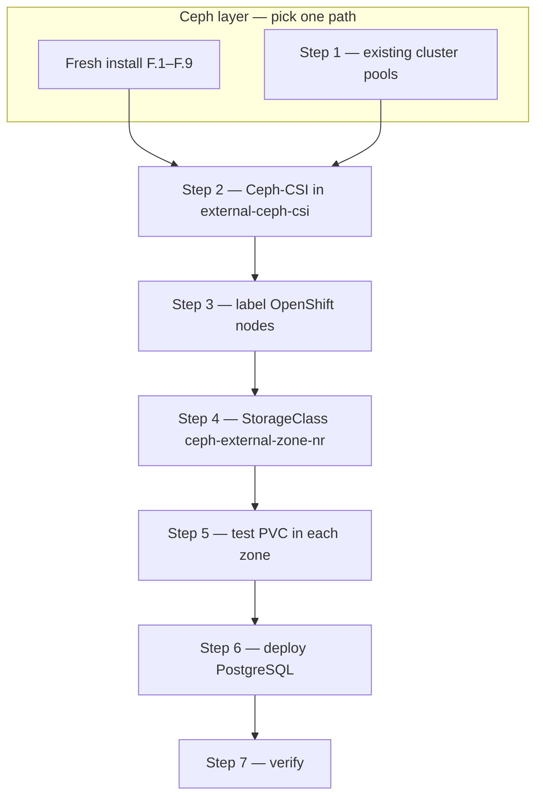
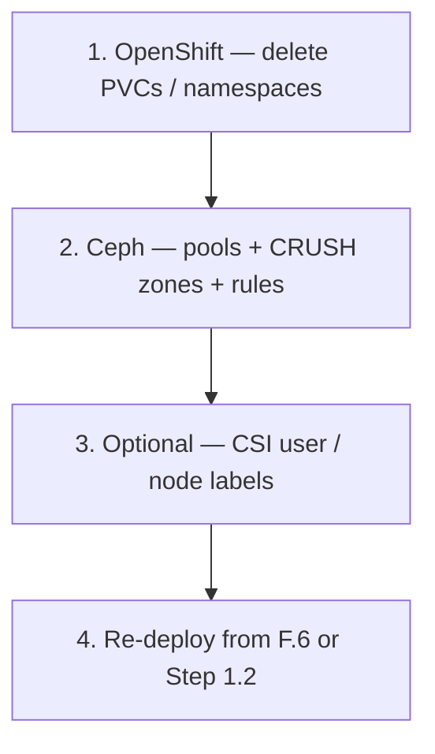

# External Ceph cluster — fresh install or existing

Deploy or reuse an **external Ceph cluster** for **zone-local RBD** on OpenShift via `rbd.csi.ceph.com`.

Use this guide when ODF cannot provision per-zone pools (e.g. `flexibleScaling: true`) — see [`exchange/SOLUTION-ZONAL-RBD.md`](exchange/SOLUTION-ZONAL-RBD.md).

| Path | When | Start here |
|------|------|------------|
| **Fresh install** (recommended) | No Ceph yet — 3 dedicated Linux nodes | [F.1](#f1-prepare-all-three-nodes) |
| **Existing Ceph** | Separate Ceph cluster already running — not recommended on ODF-shared Ceph unless you accept CRUSH change risk | [Step 1](#step-1-ceph-per-zone-pools-on-an-existing-cluster) |

> **Recommendation**  
> For zone-local RBD when ODF non-resilient pools are unavailable, **prefer a fresh install** on three dedicated storage nodes. You get zone topology and per-zone pools (F.6–F.7) without touching ODF or redeploying OpenShift Data Foundation.  
> Use the **existing-cluster** path only when you already operate an independent Ceph cluster with spare capacity — not as a shortcut to add pools on the same Ceph mons ODF uses unless you have tested CRUSH changes in non-production.

Both paths merge at **[Step 2](#step-2-deploy-ceph-csi-separate-from-odf)** (CSI on OpenShift) and follow the same Steps 3–7.

---

## End-to-end roadmap



| Step | Where | What you do | Done when |
|------|-------|-------------|-----------|
| **F.1–F.9** or **1** | Ceph nodes | Per-zone pools `rbd-zone-a/b/c`, CSI user, mon IPs | `ceph osd pool ls` shows three pools; mon IPs noted |
| **2** | OpenShift | Namespace + PSA, secret, Ceph-CSI, ConfigMap, SCC | `oc get csidriver rbd.csi.ceph.com`; CSI pods Running |
| **3** | OpenShift | `topology.kubernetes.io/zone` on workers | `oc get nodes -L topology.kubernetes.io/zone` |
| **4** | OpenShift | Apply StorageClass | `oc get sc ceph-external-zone-nr` |
| **5** | OpenShift | Test PVC + pod per zone | PVC Bound in correct zone |
| **6** | OpenShift | Deploy pg-multizone PostgreSQL | 3 postgres pods Running |
| **7** | OpenShift | Run verify scripts | Pods spread zone-a/b/c |

**Estimated time (lab):** fresh install ~2–3 h · existing cluster ~45 min · OpenShift steps ~30 min.

---

## When to use this guide

| Situation | Use this guide? |
|-----------|-----------------|
| **No Ceph yet** — dedicated storage nodes | **Yes** — [fresh install](#fresh-install-ceph-on-3-linux-nodes) (**recommended**) |
| ODF `flexibleScaling: true`, `failureDomain: host` | **Yes** — [fresh install](#fresh-install-ceph-on-3-linux-nodes) preferred; [existing cluster](#step-1-ceph-per-zone-pools-on-an-existing-cluster) if you already have separate Ceph |
| ODF non-resilient pools already work | **No** — use [`ZONE-LOCAL-RBD.md`](runbooks/openshift/ZONE-LOCAL-RBD.md) with `cephrbd-multizone-nr` |
| Greenfield ODF with zone topology | Prefer native ODF NR pools over a second CSI driver |

---

## Before you start — collect these values

Fill this in as you work; you need every row before Step 2.

| Value | Example | Where to get it |
|-------|---------|-----------------|
| Monitor IPs (`:6789`) | `192.168.1.11:6789,192.168.1.12:6789,192.168.1.13:6789` | F.8 or Step 1.5 — `ceph mon dump` |
| Zone names | `zone-a`, `zone-b`, `zone-c` | [`topology/zones.env`](runbooks/openshift/topology/zones.env) — must match CRUSH buckets, pools, node labels, and manifests |
| Pool names | `rbd-zone-a`, `rbd-zone-b`, `rbd-zone-c` | `rbd_pool_for_zone()` in `zones.env`; F.7 or Step 1.3 |
| CSI Ceph user | `client.csi-rbd-external` | F.8-alt or Step 1.4 |
| CSI user key | `(secret)` | `ceph auth get-key client.csi-rbd-external` |
| `clusterID` in ConfigMap / StorageClass | `ceph-external` | **`CSI_CLUSTER_ID`** in [`topology/zones.env`](runbooks/openshift/topology/zones.env) — logical Ceph-CSI key; must match both objects; **not** `ceph fsid` |
| K8s zone label key | `topology.kubernetes.io/zone` | `K8S_ZONE_LABEL` in [`topology/zones.env`](runbooks/openshift/topology/zones.env) |
| StorageClass name | `ceph-external-zone-nr` | [`manifests/topology/storageclass-ceph-external-zone-nr.yaml`](runbooks/openshift/manifests/topology/storageclass-ceph-external-zone-nr.yaml) |
| Ceph version | `20.2.x` Tentacle (example) | F.2 — latest Tentacle patch from [download.ceph.com](https://download.ceph.com/); confirm with `ceph version` after bootstrap |
| Ceph major (for Ceph-CSI) | `20` | `CEPH_MAJOR` in [Step 2.2](#22-install-ceph-csi-latest-compatible-release) — from `ceph version` on admin node, or set manually |

### Topology alignment (Ceph ↔ Kubernetes)

All zone identifiers must use the **same strings** everywhere. Defaults live in [`runbooks/openshift/topology/zones.env`](runbooks/openshift/topology/zones.env).

| Layer | Field | Example values | Must match |
|-------|-------|----------------|------------|
| Ceph CRUSH bucket | name | `zone-a`, `zone-b`, `zone-c` | `ZONES` in `zones.env` |
| Ceph CRUSH bucket | type | `zone` | `move … zone=zone-a` parent type |
| Ceph RBD pool | name | `rbd-zone-a`, … | `rbd_pool_for_zone(zone-a)` |
| Ceph CRUSH rule | name | `replicated-zone-a`, … | `crush_rule_for_zone(zone-a)` |
| Ceph orch host label | `zone=<value>` | `zone-a`, … | Same as K8s zone label **value** |
| OpenShift node | `topology.kubernetes.io/zone` | `zone-a`, … | `K8S_ZONE_LABEL` + `ZONES` |
| ConfigMap `ceph-csi-config` | `clusterID`, `monitors` only | `ceph-external`, mon IPs | Logical `clusterID` (≠ `ceph fsid`); **no zones** |
| StorageClass | `topologyConstrainedPools` | `rbd-zone-a` ↔ `zone-a` | [`storageclass-ceph-external-zone-nr.yaml`](runbooks/openshift/manifests/topology/storageclass-ceph-external-zone-nr.yaml) |
| StorageClass | `allowedTopologies` | `zone-a`, `zone-b`, `zone-c` | Same as node labels |
| StatefulSet | `nodeAffinity` zone values | `zone-a`, … | [`statefulset-external-rbd-nr.yaml`](runbooks/openshift/manifests/pg/statefulset-external-rbd-nr.yaml) |

If your cloud provider already uses different zone names (e.g. `us-east-1a`), **change `ZONES` in `zones.env` first**, then recreate Ceph CRUSH buckets/pools and update every manifest row in the table above.

Verify before provisioning PVCs:

```bash
# On Ceph admin node (after F.6 / Step 1.2–1.3)
bash runbooks/openshift/topology/verify-ceph-topology.sh

# On OpenShift (after Step 3–4)
cd runbooks/openshift && ./topology/verify-alignment.sh
```

---

## Architecture

**Existing Ceph (shared with ODF):**

```
┌─────────────────────────────────────────────┐
│  Existing Ceph (shared with ODF)            │
│  ├── ocs-storagecluster-cephblockpool       │  ← ODF driver (unchanged)
│  └── NEW: rbd-zone-a / -b / -c (size 1)     │  ← External CSI (zone-local)
└─────────────────────────────────────────────┘
```

**Fresh install (3 dedicated Linux nodes):**

```
┌─────────────────────────────────────────────┐
│  New Ceph cluster (ceph-node1/2/3)          │
│  rbd-zone-a / rbd-zone-b / rbd-zone-c       │  ← Created in F.7
└─────────────────────────────────────────────┘
```

**Common OpenShift layer:**

```
          ▲ TCP 6789 (mons)
┌─────────────────────────────────────────────┐
│  Namespace: external-ceph-csi               │
│  Driver: rbd.csi.ceph.com                   │
│  StorageClass: ceph-external-zone-nr        │
└─────────────────────────────────────────────┘
          ▲
┌─────────────────────────────────────────────┐
│  OpenShift — topology.kubernetes.io/zone    │
└─────────────────────────────────────────────┘
```

**Principles**

- Do **not** modify ODF pools or the `openshift-storage` namespace.
- Add **new, empty** RBD pools and a **separate** CSI deployment.
- Pick the StorageClass per workload (`openshift-storage.rbd.csi.ceph.com` vs `rbd.csi.ceph.com`).

---

## Pre-flight checks

Run **before** changing Ceph or OpenShift.

### On OpenShift

```bash
oc whoami
oc get nodes
oc get csidriver openshift-storage.rbd.csi.ceph.com   # ODF — leave as-is
```

### On Ceph (existing cluster) or after fresh install

```bash
ceph -s                    # HEALTH_OK or documented HEALTH_WARN
ceph osd tree              # hosts under zone-a / zone-b / zone-c
ceph osd pool ls | grep rbd-zone
```

### Network — from an OpenShift worker

```bash
# Replace with your monitor IPs
for ip in 192.168.1.11 192.168.1.12 192.168.1.13; do
  nc -zv "$ip" 6789 || echo "FAIL: $ip:6789"
done
```

| Item | Requirement |
|------|-------------|
| Access | `cluster-admin` on OpenShift; `ceph` CLI on a monitor/admin node |
| Ceph | Healthy cluster; monitors reachable from all workers on port **6789** |
| Topology | ≥ 3 zones with OSDs (or one OSD host per zone in lab) |
| Nodes | Labelled `topology.kubernetes.io/zone` — [Step 3](#step-3-label-openshift-nodes) |
| Change window | CRUSH edits on existing clusters — back up first; validate in non-prod |

---

## Fresh install — Ceph on 3 Linux nodes

> **Skip this section if you already have a Ceph cluster** (e.g. shared with ODF). Go to [Step 1](#step-1-ceph-per-zone-pools-on-an-existing-cluster), then continue at [Step 2](#step-2-deploy-ceph-csi-separate-from-odf).

Deploy a **standalone Ceph cluster** on three Linux hosts with zone topology from day one. OpenShift connects via Ceph-CSI in Step 2 — no ODF required on the storage nodes.

> **Recommended release:** [**Tentacle**](https://docs.ceph.com/en/tentacle/) (Ceph 20.x) — the current stable major release for fresh deployments. F.2 installs the latest Tentacle patch from [download.ceph.com](https://download.ceph.com/).

### Lab topology

| Node | Example hostname | Zone label | Role |
|------|------------------|------------|------|
| 1 | `ceph-node1` | `zone-a` | Monitor + OSD + MGR |
| 2 | `ceph-node2` | `zone-b` | Monitor + OSD + MGR |
| 3 | `ceph-node3` | `zone-c` | Monitor + OSD + MGR |

```
zone-a (ceph-node1)     zone-b (ceph-node2)     zone-c (ceph-node3)
     │                        │                        │
     └──────────── Ceph cluster network ───────────────┘
                              │
                    OpenShift workers (separate nodes)
                    reach mons on TCP 6789
```

> OpenShift and Ceph nodes **may** be the same hosts in a tiny lab; production should use dedicated storage servers with separate OSD disks.

### Node requirements

Aligned with [Ceph Tentacle OS recommendations](https://docs.ceph.com/en/tentacle/start/os-recommendations/) and the [platform matrix](https://docs.ceph.com/en/latest/start/os-recommendations/). Use the **same OS major version on all three nodes**.

| Distribution | Version | Tentacle (20.2.z) | Notes |
|--------------|---------|-------------------|-------|
| **RHEL** | 9.x | Package + container host | `dnf` path in F.2 |
| **Rocky Linux** | 9.x | Container host | `dnf` or universal F.2 path |
| **Rocky Linux** | 10.x | Package + container host (≥ **20.2.2**) | `dnf` path in F.2 |
| **Ubuntu** | 22.04 LTS | Package + container host | Universal F.2 path; Podman |
| **Ubuntu** | 24.04 LTS | Container host | Universal F.2 path; Podman |
| CentOS Stream | 9 | Package + container host | Same as RHEL 9 |

| Item | Requirement |
|------|-------------|
| **Architecture** | `x86_64` (64-bit Intel/AMD) |
| **CPU / RAM** | 4 vCPU, 8 GiB RAM minimum per node (lab) |
| **Disk** | **One unused raw device per node** for OSD (e.g. `/dev/sdb`) — no filesystem |
| **Network** | Static IPs; nodes reach each other; workers reach mon IPs on **6789** |
| **Time** | Chrony/NTP synced |
| **Container runtime** | **Podman** on all distros — do not install Docker |
| **Access** | `root` or passwordless `sudo` on all three nodes |
| **Not supported** | Ubuntu 20.04 (EOL for Tentacle), Windows, mixed OS majors in one cluster |

Verify OS before F.1:

```bash
source /etc/os-release
echo "${PRETTY_NAME} — ${VERSION_ID}"
uname -m   # expect x86_64
```

### F.1 Prepare all three nodes

Run on **each** node (`ceph-node1`, `ceph-node2`, `ceph-node3`):

```bash
# RHEL 9 / Rocky Linux 9 or 10
sudo dnf install -y podman lvm2 chrony
sudo systemctl enable --now chrony

# Ubuntu 22.04 / 24.04 LTS — Podman only (do not install docker.io)
sudo apt update && sudo apt install -y podman lvm2 chrony
sudo systemctl enable --now chrony
# If Docker was ever installed, remove it so cephadm does not pick it:
# sudo apt remove -y docker.io docker-ce docker-ce-cli containerd.io 2>/dev/null || true

# Firewall — RHEL / Rocky (firewalld)
sudo firewall-cmd --permanent --add-port=6789/tcp
sudo firewall-cmd --permanent --add-port=6800-7300/tcp
sudo firewall-cmd --reload

# Firewall — Ubuntu (ufw), if enabled
# sudo ufw allow 6789/tcp
# sudo ufw allow 6800:7300/tcp

lsblk   # confirm raw OSD device (e.g. /dev/sdb, no mount)
```

Set hostnames and `/etc/hosts` (or use DNS). The name registered in Ceph **must match** `hostname` on each node exactly.

**Option A — short hostname (lab default):**

```bash
sudo hostnamectl set-hostname ceph-node1   # ceph-node2, ceph-node3 on other nodes

cat <<EOF | sudo tee -a /etc/hosts
192.168.1.11 ceph-node1
192.168.1.12 ceph-node2
192.168.1.13 ceph-node3
EOF

hostname   # ceph-node1 — use this string in F.3/F.4
```

**Option B — FQDN** (e.g. `ceph-node1.example.com`). Use when your environment already sets fully qualified hostnames. You **must** pass `--allow-fqdn-hostname` at bootstrap (F.3) and use the **same FQDN** in `ceph orch host add` (F.4):

```bash
sudo hostnamectl set-hostname ceph-node1.example.com   # .example.com on each node

cat <<EOF | sudo tee -a /etc/hosts
192.168.1.11 ceph-node1.example.com ceph-node1
192.168.1.12 ceph-node2.example.com ceph-node2
192.168.1.13 ceph-node3.example.com ceph-node3
EOF

hostname   # ceph-node1.example.com — use this exact string in F.3/F.4
```

### F.2 Install cephadm on the first node

On **`ceph-node1`** only. Fresh deployments use **Tentacle** (`CEPH_RELEASE=tentacle`, Ceph 20.x) — the current recommended stable release — and resolve the **latest Tentacle patch** from [download.ceph.com](https://download.ceph.com/) at install time.

**1. Set release and resolve latest patch** (run on `ceph-node1`):

```bash
# Recommended for fresh install — current stable major release
CEPH_RELEASE=tentacle

# Latest Tentacle patch (20.x.y) on the official mirror
CEPH_VERSION=$(curl -sL https://download.ceph.com/ \
  | grep -oE 'href="rpm-20\.[0-9]+\.[0-9]+/' \
  | sed 's|href="rpm-||;s|/||' | sort -V | tail -1)

echo "Ceph ${CEPH_VERSION} (${CEPH_RELEASE})"
```

**2. Install `cephadm`** — pick **one** path for your OS (see [node requirements](#node-requirements)).

**RHEL 9 / Rocky Linux 9 or 10** — Tentacle repo via release name (`dnf`; Rocky 10 package install needs Ceph **≥ 20.2.2**):

```bash
sudo dnf install -y centos-release-ceph-tentacle
sudo dnf install -y cephadm
sudo cephadm add-repo --release "${CEPH_RELEASE}"
sudo cephadm install
sudo cephadm version
```

**Ubuntu 22.04 / 24.04 LTS** — bootstrap `cephadm` from the versioned RPM, then install the exact Tentacle patch:

```bash
# el9/noarch cephadm is the bootstrap CLI on Ubuntu (Ceph daemons still run in containers)
EL_VERSION=9
curl --silent --remote-name --location \
  "https://download.ceph.com/rpm-${CEPH_VERSION}/el${EL_VERSION}/noarch/cephadm"
chmod +x cephadm

# Podman must already be installed on all nodes (F.1). Do not install Docker.
sudo ./cephadm add-repo --version "${CEPH_VERSION}"
sudo ./cephadm install          # default: Podman — do not pass --docker

sudo cephadm version
sudo podman --version
```

If `add-repo` fails fetching `release.gpg`, use [F.2b](#f2b-manual-repo-setup-when-add-repo-fails-releasegpg-vs-releaseasc) instead of `add-repo`.

**Fallback** — if `dnf` packages lag behind the mirror, use the Ubuntu/universal block above on RHEL/Rocky as well. If `cephadm add-repo` fails on GPG fetch, use [F.2b](#f2b-manual-repo-setup-when-add-repo-fails-releasegpg-vs-releaseasc).

> **Podman on Ubuntu**  
> `cephadm` defaults to **Podman** (`--docker` is only for forcing Docker). Install Podman via `apt` and **avoid** `docker.io` / Docker CE on storage nodes.

> **Important**  
> `cephadm add-repo` accepts **either** `--release` **or** `--version`, not both. Use `--release tentacle` when you want the current packages from the Tentacle line, or `--version 20.x.y` when you want to pin an exact patch.

> **Other releases**  
> For an older line (e.g. Squid 19.x), set `CEPH_RELEASE=squid` and filter `CEPH_VERSION` for `rpm-19.*` instead. Then choose one mode:
> - `add-repo --release "${CEPH_RELEASE}"` for the latest packages in that line
> - `add-repo --version "${CEPH_VERSION}"` for one exact patch
> 
> Active releases: [Ceph releases](https://docs.ceph.com/en/latest/releases/).

### F.2b Manual repo setup when `add-repo` fails (`release.gpg` vs `release.asc`)

Some `cephadm` builds fail at `add-repo` because the script expects `release.gpg` on [download.ceph.com](https://download.ceph.com/), while the mirror only publishes `release.asc`. The error blocks the command with no override flag.

**Workaround:** import the GPG key and add the repo yourself — same result as `add-repo`, then run `cephadm install` as usual.

#### Debian / Ubuntu (APT)

On **`ceph-node1`**, after setting `CEPH_RELEASE` / `CEPH_VERSION` in F.2:

```bash
# Import key (APT expects dearmored keyring on recent Ubuntu)
sudo wget -q -O- 'https://download.ceph.com/keys/release.asc' \
  | sudo gpg --dearmor -o /usr/share/keyrings/ceph-archive-keyring.gpg

# Release line (e.g. tentacle) — use ONE of the two repo lines below:
echo "deb [signed-by=/usr/share/keyrings/ceph-archive-keyring.gpg] https://download.ceph.com/debian-${CEPH_RELEASE}/ $(lsb_release -sc) main" \
  | sudo tee /etc/apt/sources.list.d/ceph.list

# Exact patch pin (e.g. 20.2.2) — alternative to the line above:
# echo "deb [signed-by=/usr/share/keyrings/ceph-archive-keyring.gpg] https://download.ceph.com/debian-${CEPH_VERSION}/ $(lsb_release -sc) main" \
#   | sudo tee /etc/apt/sources.list.d/ceph.list

sudo apt-get update
sudo ./cephadm install    # or: sudo cephadm install
sudo cephadm version
```

#### RHEL / Rocky Linux (DNF/YUM)

If `cephadm add-repo` fails even after `centos-release-ceph-tentacle`:

```bash
sudo rpm --import 'https://download.ceph.com/keys/release.asc'

# Release line (tentacle) on EL9:
sudo tee /etc/yum.repos.d/ceph.repo <<EOF
[ceph]
name=Ceph ${CEPH_RELEASE}
baseurl=https://download.ceph.com/rpm-${CEPH_RELEASE}/el\$(rpm -E %rhel)/
enabled=1
gpgcheck=1
gpgkey=https://download.ceph.com/keys/release.asc
EOF

# Exact patch pin — replace the baseurl line with:
# baseurl=https://download.ceph.com/rpm-${CEPH_VERSION}/el\$(rpm -E %rhel)/

sudo dnf clean all
sudo cephadm install
sudo cephadm version
```

> **Note:** `add-repo` only generates the `.list` / `.repo` file and imports the key. Manual setup skips the broken URL in the script; you do not need `add-repo` afterward.

### F.3 Bootstrap the cluster

On **`ceph-node1`** — replace IPs and CIDRs:

```bash
MONITOR_IP=192.168.1.11
CLUSTER_NETWORK=192.168.1.0/24   # OSD replication / cluster traffic (optional if same as client network)
PUBLIC_NETWORK=192.168.1.0/24    # client + mon access — set after bootstrap (see below)

# Short hostname (Option A in F.1) — save bootstrap output (dashboard URL, FSID, credentials):
sudo cephadm bootstrap \
  --mon-ip "${MONITOR_IP}" \
  --cluster-network "${CLUSTER_NETWORK}" \
  --initial-dashboard-password 'ChangeMe123!' \
  --single-host-defaults 2>&1 | tee "ceph-bootstrap-$(hostname)-$(date +%F-%H%M%S).log"

# FQDN hostname (Option B in F.1) — add --allow-fqdn-hostname when hostname contains a dot:
# sudo cephadm bootstrap \
#   --mon-ip "${MONITOR_IP}" \
#   --cluster-network "${CLUSTER_NETWORK}" \
#   --allow-fqdn-hostname \
#   --initial-dashboard-password 'ChangeMe123!' \
#   --single-host-defaults 2>&1 | tee "ceph-bootstrap-$(hostname)-$(date +%F-%H%M%S).log"
# Do not pass --docker — use Podman (default on all distros when Docker is not installed)
```

> **Save bootstrap output**  
> `tee` writes the log to a file **and** prints it to the terminal. The file contains the dashboard URL (`https://<host>:8443`), `admin` password reminder, and cluster FSID — keep it in a secure location.

> **Default bootstrap / cephadm log locations** (on the bootstrap node):
>
> | Path | Contents |
> |------|----------|
> | `ceph-bootstrap-<hostname>-<timestamp>.log` | Your `tee` capture of the bootstrap command (current directory) |
> | `/etc/ceph/` | Cluster access files written by bootstrap — `ceph.conf`, `ceph.client.admin.keyring`, `ceph.pub` |
> | `/var/log/ceph/cephadm.log` | `cephadm` tool log |
> | `/var/lib/ceph/<fsid>/` | Daemon data directories (mon, mgr, osd, …) — `<fsid>` is printed at bootstrap |
> | `journalctl` | **Default** daemon logs (stderr → container runtime → journald) — not files under `/var/log/ceph/` unless you enable file logging |
>
> Optional: add `--log-to-file` to bootstrap to write traditional daemon logs under `/var/log/ceph/<fsid>/`.
>
> ```bash
> # After bootstrap — cluster FSID and recent cephadm events
> sudo cephadm shell -- ceph fsid
> sudo cephadm shell -- ceph log last cephadm
> journalctl -u "ceph-*" --no-pager -n 50    # distro-dependent unit names
> ```

> **FQDN hostnames**  
> By default, `cephadm bootstrap` expects a **short** hostname (`ceph-node1`). If `hostname` returns an FQDN (`ceph-node1.example.com`), bootstrap fails unless you add **`--allow-fqdn-hostname`**. Use the same FQDN in every `ceph orch host add` command in F.4.

> **`--public-network` is not a bootstrap flag**  
> `cephadm bootstrap` supports `--cluster-network` for internal OSD traffic, but **not** `--public-network`. Set the monitor public network **after** bootstrap:

```bash
sudo cephadm shell -- ceph config set mon public_network "${PUBLIC_NETWORK}"
```

If bootstrap fails with `Failed to infer CIDR network for mon ip`, either set `PUBLIC_NETWORK` to a CIDR that matches `MONITOR_IP`, or re-run bootstrap with `--skip-mon-network` and run the `ceph config set mon public_network ...` command above immediately after.

> **Lab shortcut:** `--single-host-defaults` speeds bootstrap on one node. Add hosts in F.4 before OSDs. Omit `--single-host-defaults` when all three nodes are ready. In a single-subnet lab, `CLUSTER_NETWORK` and `PUBLIC_NETWORK` are often the same CIDR.

```bash
sudo cephadm shell -- ceph -s
sudo cephadm shell -- ceph version    # confirm deployed version matches F.2
sudo cephadm shell -- ceph config get mon public_network
sudo cephadm ls                     # container engine: podman
```

When bootstrap succeeds, the **Ceph Dashboard** (web UI) is available on the bootstrap node:

| Hostname style (F.1) | Dashboard URL |
|----------------------|---------------|
| Short name | `https://ceph-node1:8443` |
| FQDN | `https://ceph-node1.example.com:8443` |

Log in with user **`admin`** and the password from `--initial-dashboard-password` (example above: `ChangeMe123!`). Bootstrap also prints the URL and credentials at the end of its output — retrieve them from the `tee` log file if you closed the terminal.

> Open port **8443** on the bootstrap node if you access the UI from another workstation (firewall / security group).

### F.4 Add the other two nodes with zone labels

Prefer a dedicated **`cephadm`** user with **passwordless sudo** on every Ceph node instead of enabling a remote root password. This avoids `ssh-copy-id root@...` and follows Ceph's supported non-root workflow.

#### F.4.1 Create the `cephadm` user on `ceph-node2` and `ceph-node3`

Run on **each target node** (`ceph-node2`, `ceph-node3`) using your existing admin access method (console, cloud-init, existing SSH user, etc.):

```bash
sudo useradd -m -s /bin/bash cephadm 2>/dev/null || true
echo 'cephadm ALL=(ALL) NOPASSWD:ALL' | sudo tee /etc/sudoers.d/cephadm
sudo chmod 440 /etc/sudoers.d/cephadm
sudo mkdir -p /home/cephadm/.ssh
sudo chmod 700 /home/cephadm/.ssh
sudo chown -R cephadm:cephadm /home/cephadm/.ssh
```

#### F.4.2 Install Ceph's cluster SSH key for `cephadm`

On **`ceph-node1`**:

```bash
sudo cephadm shell -- ceph cephadm get-pub-key > ceph.pub
```

Copy that public key into `/home/cephadm/.ssh/authorized_keys` on `ceph-node2` and `ceph-node3`.

Example from **`ceph-node1`** if you already have SSH access via another admin user:

```bash
cat ceph.pub | ssh admin@ceph-node2 "sudo tee /home/cephadm/.ssh/authorized_keys >/dev/null && sudo chown cephadm:cephadm /home/cephadm/.ssh/authorized_keys && sudo chmod 600 /home/cephadm/.ssh/authorized_keys"
cat ceph.pub | ssh admin@ceph-node3 "sudo tee /home/cephadm/.ssh/authorized_keys >/dev/null && sudo chown cephadm:cephadm /home/cephadm/.ssh/authorized_keys && sudo chmod 600 /home/cephadm/.ssh/authorized_keys"
```

If you do **not** have SSH access yet, paste the content of `ceph.pub` manually by console or cloud-init.

#### F.4.3 Tell Ceph to use the `cephadm` user and add hosts

On **`ceph-node1`**:

```bash
sudo cephadm shell -- ceph cephadm set-user cephadm
sudo cephadm shell -- ceph cephadm get-ssh-config

# --- Option A: short hostname (F.1 Option A) ---
sudo cephadm shell -- ceph orch host add ceph-node1 192.168.1.11
sudo cephadm shell -- ceph orch host add ceph-node2 192.168.1.12
sudo cephadm shell -- ceph orch host add ceph-node3 192.168.1.13

sudo cephadm shell -- ceph orch host label add ceph-node1 zone zone-a
sudo cephadm shell -- ceph orch host label add ceph-node2 zone zone-b
sudo cephadm shell -- ceph orch host label add ceph-node3 zone zone-c

# --- Option B: FQDN (F.1 Option B) — uncomment and skip Option A above ---
# sudo cephadm shell -- ceph orch host add ceph-node1.example.com 192.168.1.11
# sudo cephadm shell -- ceph orch host add ceph-node2.example.com 192.168.1.12
# sudo cephadm shell -- ceph orch host add ceph-node3.example.com 192.168.1.13
#
# sudo cephadm shell -- ceph orch host label add ceph-node1.example.com zone zone-a
# sudo cephadm shell -- ceph orch host label add ceph-node2.example.com zone zone-b
# sudo cephadm shell -- ceph orch host label add ceph-node3.example.com zone zone-c

sudo cephadm shell -- ceph orch host ls
```

> Host names in `orch host add` and `orch host label add` **must match** `hostname` on each node — use short names or FQDNs consistently, not a mix.

> Orch label **values** (`zone-a`, `zone-b`, `zone-c`) must match OpenShift `topology.kubernetes.io/zone` and CRUSH bucket names — see [`topology/zones.env`](runbooks/openshift/topology/zones.env).

> **Alternative:** if your environment already allows key-based `root` SSH without a password, you can keep the default root-based flow. The `cephadm` user approach above is preferred when you do **not** want to set a root password on remote nodes.

If `ceph orch host add` still fails with:

```text
Auth failed for user root
Connection Failure: Permission denied
Aborting connection
```

plain `ssh cephadm@ceph-node2` or `ssh cephadm@ceph-node3` may still work. In that case, `cephadm` is usually trying to use its **cluster-managed SSH key**, not your personal SSH key. Follow [F.4a](#f4a-troubleshoot-ceph-orch-host-add-ssh-auth-failures) below, then retry the `ceph orch host add` commands.

### F.4a Troubleshoot `ceph orch host add` SSH auth failures

This applies when manual SSH works, but:

```bash
sudo cephadm shell -- ceph orch host add ceph-node3 192.168.1.13
```

fails with authentication errors for the SSH user Ceph is trying to use (`cephadm` if you ran `set-user`, otherwise `root`).

#### 1. View the Ceph-managed public key

On **`ceph-node1`**:

```bash
sudo cephadm shell -- ceph cephadm get-pub-key
```

Copy the output.

#### 2. Verify the key is present on the target node

On **`ceph-node2`** and **`ceph-node3`**:

```bash
cat /home/cephadm/.ssh/authorized_keys
```

The public key from step 1 must be present. If it is missing:

```bash
sudo cephadm shell -- ceph cephadm get-pub-key > ceph.pub

ssh admin@ceph-node3 "sudo mkdir -p /home/cephadm/.ssh && sudo chmod 700 /home/cephadm/.ssh && sudo chown -R cephadm:cephadm /home/cephadm/.ssh"
cat ceph.pub | ssh admin@ceph-node3 "sudo tee -a /home/cephadm/.ssh/authorized_keys >/dev/null && sudo chown cephadm:cephadm /home/cephadm/.ssh/authorized_keys && sudo chmod 600 /home/cephadm/.ssh/authorized_keys"
```

Repeat for `ceph-node2` if needed. Replace `admin` with whatever bootstrap user you already have.

#### 3. Test SSH with Ceph's private key

Export the private key used by `cephadm`:

```bash
sudo cephadm shell -- ceph config-key get mgr/cephadm/ssh_identity_key > ceph.key
chmod 600 ceph.key
```

Then test:

```bash
ssh -i ceph.key cephadm@192.168.1.13
```

If this fails, you have confirmed the issue is with the Ceph-managed SSH identity, not with your personal shell login.

#### 4. Check SSH and sudo policy for the Ceph user

On the target node:

```bash
sudo -l -U cephadm
getent passwd cephadm
```

Expected:

```text
User cephadm may run the following commands on <host>:
    (ALL) NOPASSWD: ALL
```

Also verify SSH directory ownership:

```bash
ls -ld /home/cephadm /home/cephadm/.ssh
ls -l /home/cephadm/.ssh/authorized_keys
```

If you intentionally use `root` instead of `cephadm`, then also check:

```bash
grep PermitRootLogin /etc/ssh/sshd_config
```

#### 5. Inspect Ceph SSH configuration and logs

```bash
sudo cephadm shell -- ceph cephadm get-ssh-config
sudo cephadm shell -- ceph orch host ls
sudo cephadm shell -- ceph log last cephadm
```

Common root cause:

- You can SSH manually with your personal key or bootstrap admin user.
- `cephadm` uses the cluster key stored in `mgr/cephadm/ssh_identity_key`.
- That key is not present in the target user's `authorized_keys` file.
- The target user exists but does not have passwordless sudo.

### F.5 Deploy OSDs

```bash
sudo cephadm shell -- ceph orch apply osd --all-available-devices

watch -n5 'sudo cephadm shell -- ceph osd stat'
sudo cephadm shell -- ceph osd tree
```

Expected: **one OSD per node**, each under its host bucket.

### F.6 Configure CRUSH zones

`add-bucket` takes two arguments — **name** and **type** — not a redundant extra word:

```text
ceph osd crush add-bucket <name> <type>
```

| Command | First arg | Second arg |
|---------|-----------|------------|
| `add-bucket zone-a zone` | Bucket **name** (`zone-a`) — any unique label you choose | Bucket **type** (`zone`) — a CRUSH hierarchy level, like `host`, `rack`, or `root` |
| `move ceph-node1 zone=zone-a` | Host bucket to move | Parent link: `zone` = parent **type**, `zone-a` = parent **name** |

The type `zone` is **not** ignored. Ceph uses it when you later run `move … zone=zone-a` and when CRUSH rules reference failure domains of type `zone`. You could name the bucket `east` instead of `zone-a` and still use type `zone`; we use `zone-a` only as a readable name.

Host bucket names in `ceph osd crush move` **must match** the names from F.4 (`ceph orch host ls`) — short hostname or FQDN, same as `hostname` on each node.

**Option A — short hostname:**

```bash
sudo cephadm shell -- bash -c '
ceph osd crush add-bucket zone-a zone
ceph osd crush add-bucket zone-b zone
ceph osd crush add-bucket zone-c zone
ceph osd crush move zone-a root=default
ceph osd crush move zone-b root=default
ceph osd crush move zone-c root=default
ceph osd crush move ceph-node1 zone=zone-a
ceph osd crush move ceph-node2 zone=zone-b
ceph osd crush move ceph-node3 zone=zone-c
ceph osd tree
'
```

**Option B — FQDN** (if F.1 Option B and F.4 Option B):

```bash
sudo cephadm shell -- bash -c '
ceph osd crush add-bucket zone-a zone
ceph osd crush add-bucket zone-b zone
ceph osd crush add-bucket zone-c zone
ceph osd crush move zone-a root=default
ceph osd crush move zone-b root=default
ceph osd crush move zone-c root=default
ceph osd crush move ceph-node1.example.com zone=zone-a
ceph osd crush move ceph-node2.example.com zone=zone-b
ceph osd crush move ceph-node3.example.com zone=zone-c
ceph osd tree
'
```

### F.6a Debug — manual CRUSH inspection via crushtool (advanced)

Use this **only for troubleshooting** — not for the initial zone setup. Prefer [F.6](#f6-configure-crush-zones) (`add-bucket` / `move`) or [Step 1.2](#12-create-zone-buckets-and-place-hosts) in normal operation.

**When `crushtool` helps**

- `ceph osd tree` looks wrong but `add-bucket` / `move` fail with unclear errors.
- You need to inspect the full map (types, bucket IDs, parent links).
- A host bucket is under `default` instead of `zone-a` / `zone-b` / `zone-c` — often fixable with `ceph osd crush move` **without** editing text (try that first).
- You must prove the map is valid before applying (`crushtool --test`).

**Risks**

- Applying a bad map can trigger **data rebalancing** or placement errors.
- Always **backup** first; test in non-production when possible.
- Run on a Ceph admin node (`cephadm shell` or host with `ceph` CLI).

#### 1. Backup the live map

```bash
TS=$(date +%Y%m%d-%H%M%S)
sudo cephadm shell -- ceph osd getcrushmap -o "/tmp/crushmap-${TS}.bin"
cp "/tmp/crushmap-${TS}.bin" /tmp/crushmap-backup.bin
```

#### 2. Decompile to text

```bash
sudo cephadm shell -- crushtool -d /tmp/crushmap-backup.bin -o /tmp/crushmap.txt
less /tmp/crushmap.txt
```

Check the `# types` section includes `zone` (type id varies by cluster). Target hierarchy for pg-multizone:

```text
default (root)
├── zone-a (type zone)
│   └── ceph-node1 (type host)
│       └── osd.N
├── zone-b (type zone)
│   └── ceph-node2 (type host)
└── zone-c (type zone)
    └── ceph-node3 (type host)
```

In the text file, zone buckets are `type zone` entries; hosts must be **children of** `zone-a` / `zone-b` / `zone-c`, not direct children of `default`.

#### 3. Try CLI fix before hand-editing

If the map is wrong but buckets exist:

```bash
sudo cephadm shell -- ceph osd crush move ceph-node1 zone=zone-a
sudo cephadm shell -- ceph osd crush move ceph-node2 zone=zone-b
sudo cephadm shell -- ceph osd crush move ceph-node3 zone=zone-c
sudo cephadm shell -- ceph osd tree
```

Only edit `/tmp/crushmap.txt` if CLI commands cannot repair the structure (orphan buckets, wrong type ids, legacy `straw` vs `straw2` issues on very old maps).

#### 4. Validate a modified map (before apply)

```bash
sudo cephadm shell -- crushtool -c /tmp/crushmap.txt -o /tmp/crushmap-new.bin
sudo cephadm shell -- crushtool --test --show-testing /tmp/crushmap-new.bin
```

Fix any errors reported by `--test` before continuing.

#### 5. Apply (maintenance window recommended)

```bash
sudo cephadm shell -- ceph osd setcrushmap -i /tmp/crushmap-new.bin
sudo cephadm shell -- ceph osd tree
watch -n5 'sudo cephadm shell -- ceph -s'
```

#### 6. Rollback

```bash
sudo cephadm shell -- ceph osd setcrushmap -i /tmp/crushmap-backup.bin
```

#### 7. Confirm alignment with OpenShift

```bash
bash runbooks/openshift/topology/verify-ceph-topology.sh
```

Bucket names must still match [`topology/zones.env`](runbooks/openshift/topology/zones.env).

> **Reference:** [Ceph CRUSH map edits](https://docs.ceph.com/en/latest/rados/operations/crush-map-edits/)

### F.7 Create per-zone RBD pools

CRUSH hierarchy after F.6: `default` → `zone-a/b/c` (type **zone**) → hosts (type **host**).

`ceph osd crush rule create-replicated` syntax:

```text
ceph osd crush rule create-replicated <rule-name> <root-bucket> <failure-domain-type>
```

The 3rd argument must be a **bucket type** (`zone`, `host`, `osd`) — not a bucket name like `zone-a`. Using `zone-a` as the type causes:

```text
Error EINVAL: unknown type zone-a
```

Use each **zone bucket** as the rule root and `host` as the failure domain so pool `rbd-zone-a` only uses OSDs under `zone-a`:

```bash
sudo cephadm shell -- bash -c '
for z in zone-a zone-b zone-c; do
  ceph osd crush rule create-replicated "replicated-${z}" "${z}" host
  ceph osd pool create "rbd-${z}" 32 32 "replicated-${z}"
  ceph osd pool set "rbd-${z}" size 1
  ceph osd pool set "rbd-${z}" min_size 1
  ceph osd pool application enable "rbd-${z}" rbd
done
ceph osd pool ls detail | grep rbd-zone
'
```

> **Replica 1 warning**  
> `size 1` and `min_size 1` mean **no redundancy** — OSD loss in a zone loses data for volumes in that pool. Acceptable for a lab; **never** use `size 1` in production.

### F.8 Create CSI Ceph user (recommended: single user)

**Recommended** — one user for all pools (simpler Step 2). Multiple pools in one `osd` capability must be **comma-separated** — spaces cause `Error EINVAL`:

```bash
sudo cephadm shell -- bash -c '
ceph auth get-or-create client.csi-rbd-external \
  mon "profile rbd" \
  osd "profile rbd pool=rbd-zone-a,profile rbd pool=rbd-zone-b,profile rbd pool=rbd-zone-c" \
  mgr "allow rw"
ceph auth get-key client.csi-rbd-external
'
```

<details>
<summary>Alternative — broader OSD profile (less restrictive)</summary>

If you add zone pools often and trust this dedicated CSI user:

```bash
osd "profile rbd"
```

You lose per-pool scoping — use only on an isolated external Ceph cluster.
</details>

<details>
<summary>Alternative — one user per zone (advanced)</summary>

```bash
sudo cephadm shell -- bash -c '
for z in zone-a zone-b zone-c; do
  ceph auth get-or-create client.csi-rbd-${z} \
    mon "profile rbd" \
    osd "profile rbd pool=rbd-${z}" \
    mgr "allow rw"
done
ceph auth ls | grep csi-rbd
'
```

If you use per-zone users, create one Kubernetes secret per zone in Step 2 and adjust the StorageClass — see [Ceph-CSI topology secrets](https://github.com/ceph/ceph-csi/blob/devel/docs/design/proposals/rbd/topology.md).
</details>

### F.9 Verify cluster health

```bash
sudo cephadm shell -- ceph -s
sudo cephadm shell -- ceph osd tree
sudo cephadm shell -- ceph df

# Confirm CRUSH buckets and pools match zones.env (copy script to admin node or clone repo)
bash runbooks/openshift/topology/verify-ceph-topology.sh

# Save monitor endpoints for Step 2.3
sudo cephadm shell -- ceph mon dump | grep -oE '[0-9.]+:6789' | paste -sd,
```

| Check | Expected |
|-------|----------|
| `ceph -s` | `HEALTH_OK` (or documented `HEALTH_WARN`) |
| `ceph version` | Tentacle `20.x.y` — matches `CEPH_VERSION` from F.2 |
| `osd tree` | 3 hosts in `zone-a` / `zone-b` / `zone-c` |
| Pools | `rbd-zone-a`, `rbd-zone-b`, `rbd-zone-c` |
| Network from worker | `nc -zv <mon-ip> 6789` succeeds |

**Checkpoint:** pools, CSI user, and mon IPs recorded → continue at [Step 2](#step-2-deploy-ceph-csi-separate-from-odf). Skip [Step 1](#step-1-ceph-per-zone-pools-on-an-existing-cluster).

---

## Step 1 — Ceph: per-zone pools on an existing cluster

> **Skip this section if you completed a [fresh install](#fresh-install-ceph-on-3-linux-nodes)** (F.1–F.9). Pools and users are in F.6–F.8. Continue at [Step 2](#step-2-deploy-ceph-csi-separate-from-odf).

**Goal:** Create **one new RBD pool per zone** with `size 1`. Existing ODF pools stay untouched.

> **Resilient vs zone-local**  
> - **Zone-local (this guide):** `size 1`, one pool per zone → volume stays in the pod's zone.  
> - **Zone-spread resilient:** single pool `size 3` → use ODF `cephrbd-multizone-r` instead.

Run all commands from a Ceph toolbox or monitor node with the `ceph` CLI (`oc rsh -n openshift-storage rook-ceph-tools` on ODF).

### 1.1 Back up CRUSH and inspect topology

```bash
ceph osd crush export > crush-map-backup-$(date +%F).txt
ceph osd tree
ceph osd crush rule ls
```

### 1.2 Create zone buckets and place hosts

`add-bucket` syntax is `ceph osd crush add-bucket <name> <type>`. In `add-bucket zone-a zone`, the first `zone-a` is the bucket **name**; the second `zone` is the bucket **type** (a CRUSH level like `host` or `root`) — it is required, not ignored. The same type appears in `move ocp-node1 zone=zone-a` (`zone` = parent type, `zone-a` = parent name). See [F.6](#f6-configure-crush-zones) for a full breakdown.

Replace host names with yours (`ocp-node1` → `zone-a`, etc.):

```bash
ceph osd crush add-bucket zone-a zone
ceph osd crush add-bucket zone-b zone
ceph osd crush add-bucket zone-c zone

ceph osd crush move zone-a root=default
ceph osd crush move zone-b root=default
ceph osd crush move zone-c root=default

ceph osd crush move ocp-node1 zone=zone-a
ceph osd crush move ocp-node2 zone=zone-b
ceph osd crush move ocp-node3 zone=zone-c

ceph osd tree
```

> **Debug:** if `add-bucket` / `move` fail or `ceph osd tree` does not match [`zones.env`](runbooks/openshift/topology/zones.env), see [F.6a — manual CRUSH inspection via `crushtool`](#f6a-debug-manual-crush-inspection-via-crushtool-advanced) (backup, decompile, validate, rollback).

> **Caution:** CRUSH moves can trigger rebalancing. Monitor `ceph -s` during changes.

### 1.3 Create per-zone replicated rules and pools

```bash
for z in zone-a zone-b zone-c; do
  ceph osd crush rule create-replicated "replicated-${z}" "${z}" host
  ceph osd pool create "rbd-${z}" 32 32 "replicated-${z}"
  ceph osd pool set "rbd-${z}" size 1
  ceph osd pool set "rbd-${z}" min_size 1
  ceph osd pool application enable "rbd-${z}" rbd
done

ceph osd pool ls detail | grep rbd-zone
```

```bash
# From repo checkout on Ceph admin node
bash runbooks/openshift/topology/verify-ceph-topology.sh
```

> Zone and pool names must match [`topology/zones.env`](runbooks/openshift/topology/zones.env). See [F.7](#f7-create-per-zone-rbd-pools) for CRUSH rule syntax — the 3rd argument must be a bucket **type** (`host`), not a bucket name (`zone-a`).

### 1.4 Create CSI Ceph user

**Recommended** — single user (matches Step 2 and the bundled StorageClass). Use commas between pool grants — not spaces:

```bash
ceph auth get-or-create client.csi-rbd-external \
  mon 'profile rbd' \
  osd 'profile rbd pool=rbd-zone-a,profile rbd pool=rbd-zone-b,profile rbd pool=rbd-zone-c' \
  mgr 'allow rw'

ceph auth get-key client.csi-rbd-external
```

### 1.5 Save monitor addresses

```bash
ceph mon dump | grep -oE '[0-9.]+:6789' | paste -sd,
# Example: 10.0.0.11:6789,10.0.0.12:6789,10.0.0.13:6789
```

**Checkpoint:** three pools, CSI key, mon list → [Step 2](#step-2-deploy-ceph-csi-separate-from-odf).

---

## Step 2 — Deploy Ceph-CSI (separate from ODF)

Uses namespace **`external-ceph-csi`** — ODF in `openshift-storage` is unchanged.

| Substep | Run on | Needs |
|---------|--------|--------|
| 2.1 — CSI secret key | **Ceph admin node** | `ceph` CLI or `cephadm shell` with cluster access |
| 2.1 — namespace, secret, PSA | **OpenShift workstation** | `oc` cluster-admin |
| 2.2 — `CEPH_MAJOR` | **Ceph admin node** | `cephadm` deployed (fresh install) or `ceph` + keyring (existing cluster) |
| 2.2 — apply Ceph-CSI manifests | **OpenShift workstation** | `oc`, `curl` |
| 2.3–2.5 | **OpenShift workstation** | `oc` |

> **Not on a Ceph node?** SSH to a monitor/admin host first for 2.1 (key) and 2.2 (`CEPH_MAJOR`). You cannot run `cephadm shell` or `ceph auth get-key` from a host that has no Ceph client config and no route to the cluster. Alternatively, set `CEPH_MAJOR` manually from [F.9](#f9-verify-cluster-health) / Step 1.5 output (Tentacle = `20`).

### 2.1 Create namespace, Pod Security, and CSI secret

**On OpenShift workstation** — PSA and namespace:

OpenShift enforces **Pod Security Admission (PSA)**. CSI node plugins need `privileged` access (host paths, block devices). Label the namespace before or right after creation:

```bash
oc create namespace external-ceph-csi

oc label namespace external-ceph-csi \
  pod-security.kubernetes.io/enforce=privileged \
  pod-security.kubernetes.io/audit=privileged \
  pod-security.kubernetes.io/warn=privileged \
  --overwrite
```

> PSA `privileged` on `external-ceph-csi` is standard for CSI drivers, CNI, and similar infrastructure. Application namespaces stay on `restricted`.

**On Ceph admin node** — fetch the CSI user key (requires cluster access; `cephadm shell` only works where `cephadm` is installed, typically the bootstrap host):

```bash
ceph auth get-key client.csi-rbd-external
# cephadm-managed cluster:
# sudo cephadm shell -- ceph auth get-key client.csi-rbd-external
```

**On OpenShift workstation** — create the secret (paste the key, or export it from the admin node):

```bash
# If you still have shell on the Ceph admin node with cluster access:
CSI_KEY=$(ceph auth get-key client.csi-rbd-external)

# Or paste manually: CSI_KEY='<key from ceph auth get-key>'

oc -n external-ceph-csi create secret generic csi-rbd-secret \
  --from-literal=userID=csi-rbd-external \
  --from-literal=userKey="${CSI_KEY}"
```

### 2.2 Install Ceph-CSI (latest compatible release)

Resolve the **latest Ceph-CSI tag** and confirm it supports your Ceph major version ([compatibility matrix](https://github.com/ceph/ceph-csi#ceph-csi-features-and-available-versions)).

**On Ceph admin node** — read the cluster major version (needs `cephadm` on fresh installs, or plain `ceph` with a valid `ceph.conf`/keyring on existing clusters):

```bash
# cephadm-managed cluster (F.1–F.9) — run on bootstrap / admin node only
CEPH_MAJOR=$(sudo cephadm shell -- ceph version 2>/dev/null \
  | grep -oE '[0-9]+\.[0-9]+' | head -1 | cut -d. -f1)

# Existing cluster without cephadm on this host — if ceph CLI already works:
# CEPH_MAJOR=$(ceph version 2>/dev/null | grep -oE '[0-9]+\.[0-9]+' | head -1 | cut -d. -f1)

echo "Ceph major: ${CEPH_MAJOR}"
```

If you only have an OpenShift workstation, set `CEPH_MAJOR` manually from the version you recorded in F.9 or Step 1.5 (e.g. Tentacle `ceph version` → `ceph version 20.2.0 …` → `CEPH_MAJOR=20`).

**On OpenShift workstation** — resolve Ceph-CSI release and apply manifests:

```bash
# Set if not exported from the Ceph admin shell (Tentacle example):
CEPH_MAJOR="${CEPH_MAJOR:-20}"

# Latest Ceph-CSI release from GitHub
CEPH_CSI_VERSION=$(curl -sL https://api.github.com/repos/ceph/ceph-csi/releases/latest \
  | grep -oE '"tag_name":\s*"v[^"]+"' | cut -d'"' -f4)

echo "Ceph major ${CEPH_MAJOR} — Ceph-CSI ${CEPH_CSI_VERSION}"
# If the matrix does not list this pair, pick the newest CSI version that does.

NS=external-ceph-csi

# 1. CSIDriver object (cluster-scoped — registers rbd.csi.ceph.com)
curl -sL "https://raw.githubusercontent.com/ceph/ceph-csi/${CEPH_CSI_VERSION}/deploy/rbd/kubernetes/csidriver.yaml" \
  | oc apply -f -

# 2. RBAC + workloads (namespace from sed)
for manifest in \
  csi-provisioner-rbac.yaml \
  csi-nodeplugin-rbac.yaml \
  csi-rbdplugin-provisioner.yaml \
  csi-rbdplugin.yaml
do
  body=$(curl -sL "https://raw.githubusercontent.com/ceph/ceph-csi/${CEPH_CSI_VERSION}/deploy/rbd/kubernetes/${manifest}" \
    | sed -e "s/namespace: default/namespace: ${NS}/g" \
          -e "s/namespace: cephcsi/namespace: ${NS}/g")
  # Node plugin must advertise topology.kubernetes.io/zone (StorageClass + node labels).
  # Without --domainlabels, Ceph-CSI defaults to topology.rbd.csi.ceph.com/zone and PVCs fail.
  if [[ "${manifest}" == "csi-rbdplugin.yaml" ]]; then
    body=$(printf '%s\n' "${body}" \
      | sed '/--drivername=rbd.csi.ceph.com/a\
            - "--domainlabels=topology.kubernetes.io/zone"')
  fi
  printf '%s\n' "${body}" | oc apply -f -
done
```

> **Do not skip `csidriver.yaml`** — without it, `oc get csidriver rbd.csi.ceph.com` returns `NotFound` and CSI sidecars crash on startup.

If CSI was **already deployed** without `--domainlabels`, see [§2.2a](#22a-patch-existing-deployment-domainlabels). If the flag exists but has the wrong label key, see [§2.2b](#22b-update-wrong-domainlabels-value).

Or use the [Helm chart](https://github.com/ceph/ceph-csi/tree/devel/charts/ceph-csi-rbd) with `namespaceOverride: external-ceph-csi`, a chart version matching `${CEPH_CSI_VERSION}`, and:

```yaml
topology:
  domainLabels:
    - topology.kubernetes.io/zone
```

### 2.2a Patch existing deployment (`--domainlabels`)

Use this when Ceph-CSI was installed **before** the `--domainlabels` flag was added in Step 2.2 (raw manifests or an older copy of this guide). Without it, the node plugin advertises `topology.rbd.csi.ceph.com/zone` while the StorageClass expects `topology.kubernetes.io/zone`, and PVC provisioning fails with:

```text
error generating accessibility requirements: topology [{topology.rbd.csi.ceph.com/zone zone-a}]
from selected node "…" is not in requisite: [[{topology.kubernetes.io/zone zone-a}] …]
```

**1. Check** whether the flag is already present:

```bash
NS=external-ceph-csi
oc -n "${NS}" get daemonset csi-rbdplugin -o json \
  | jq -r '.spec.template.spec.containers[] | select(.name=="csi-rbdplugin") | .args[]?' \
  | grep '^--domainlabels=' || echo "MISSING"
```

**2. Patch** the node plugin DaemonSet and wait for rollout (only when step 1 prints `MISSING`):

```bash
NS=external-ceph-csi
oc -n "${NS}" patch daemonset csi-rbdplugin --type=json -p='[
  {"op":"add","path":"/spec/template/spec/containers/0/args/-","value":"--domainlabels=topology.kubernetes.io/zone"}
]'
oc -n "${NS}" rollout status daemonset/csi-rbdplugin
```

> If step 1 shows a **different** `--domainlabels=…` value, do not use `add` (it will fail or duplicate). Follow [§2.2b](#22b-update-wrong-domainlabels-value) to **replace** the arg. If you installed via **Helm**, set `topology.domainLabels: [topology.kubernetes.io/zone]` and `helm upgrade` instead of patching the DaemonSet by hand.

**3. Verify** alignment (includes DaemonSet check):

```bash
cd runbooks/openshift && ./topology/verify-alignment.sh
```

**4. Re-test** provisioning — delete PVCs stuck in `ProvisioningFailed`, then repeat [Step 5](#step-5-test-zone-local-provisioning).

### 2.2b Update wrong `--domainlabels` value

Use this when `--domainlabels` is **already set** but to the wrong label key — for example `failure-domain/zone` (upstream comment example), a cloud AZ label, or any value **other than** `topology.kubernetes.io/zone`. The provisioner error is the same as in [§2.2a](#22a-patch-existing-deployment-domainlabels): node topology keys do not match `topologyConstrainedPools` / `allowedTopologies` on the StorageClass.

**1. Inspect** the current value:

```bash
NS=external-ceph-csi
WANT="topology.kubernetes.io/zone"

oc -n "${NS}" get daemonset csi-rbdplugin -o json \
  | jq -r --arg want "${WANT}" '
    .spec.template.spec.containers[] | select(.name=="csi-rbdplugin") | .args[]?
    | select(startswith("--domainlabels="))
    | if . == ("--domainlabels=" + $want) then "OK: \(.)"
      else "WRONG: \(.) — expected --domainlabels=\($want)" end
  '
```

**2. Replace** the arg (finds the `csi-rbdplugin` container and arg index automatically):

```bash
NS=external-ceph-csi
WANT="topology.kubernetes.io/zone"

PATCH=$(oc -n "${NS}" get daemonset csi-rbdplugin -o json | jq -c --arg want "${WANT}" '
  .spec.template.spec.containers
  | to_entries[]
  | select(.value.name == "csi-rbdplugin")
  | .key as $ci
  | .value.args
  | to_entries[]
  | select(.value | startswith("--domainlabels="))
  | select(.value != ("--domainlabels=" + $want))
  | {
      op: "replace",
      path: ("/spec/template/spec/containers/" + ($ci | tostring) + "/args/" + (.key | tostring)),
      value: ("--domainlabels=" + $want)
    }
')

if [[ -z "${PATCH}" || "${PATCH}" == "null" ]]; then
  echo "Nothing to replace — already --domainlabels=${WANT}, or flag missing (use §2.2a)"
else
  oc -n "${NS}" patch daemonset csi-rbdplugin --type=json -p="[${PATCH}]"
  oc -n "${NS}" rollout status daemonset/csi-rbdplugin
fi
```

> **Helm:** set `topology.domainLabels: [topology.kubernetes.io/zone]` (remove other entries), then `helm upgrade` — do not hand-edit the DaemonSet or Helm will overwrite your patch on the next upgrade.

**3. Verify** and re-test — same as [§2.2a steps 3–4](#22a-patch-existing-deployment-domainlabels).

### 2.3 Cluster ConfigMap

Replace monitor IPs with your values from F.9 or Step 1.5. **`clusterID` must match** the StorageClass parameter `ceph-external`.

> **`clusterID` is a logical name for Ceph-CSI**, not the Ceph cluster FSID. You choose it (e.g. `ceph-external`); the same string must appear in this ConfigMap and in the StorageClass `parameters.clusterID`. The real cluster identity is resolved via `monitors` + CSI credentials. Do **not** substitute `ceph fsid` unless you deliberately use that string everywhere — this guide uses `ceph-external` for clarity when multiple clusters or ODF coexist.

> **Zones do not belong in this ConfigMap.** `ceph-csi-config` only tells Ceph-CSI how to reach the cluster (`clusterID` + `monitors`). Zone → pool mapping is in the **StorageClass** (`topologyConstrainedPools`, Step 4) and **node labels** (`topology.kubernetes.io/zone`, Step 3). Do not add zone names or `topologyConstrainedPools` to `config.json`.
>
> **Topology domain key** is configured on the **node plugin** (`--domainlabels=topology.kubernetes.io/zone` in Step 2.2, or Helm `topology.domainLabels`). That makes the CSI driver advertise the same key as `allowedTopologies` / `domainSegments` in the StorageClass — not via this ConfigMap.

```bash
cat <<'EOF' | oc -n external-ceph-csi apply -f -
apiVersion: v1
kind: ConfigMap
metadata:
  name: ceph-csi-config
data:
  config.json: |
    [
      {
        "clusterID": "ceph-external",
        "monitors": [
          "192.168.1.11:6789",
          "192.168.1.12:6789",
          "192.168.1.13:6789"
        ]
      }
    ]
EOF
```

If `clusterID` in the ConfigMap and StorageClass **do not match** each other (or do not match `ceph-external`), see [§2.3a](#23a-fix-inconsistent-clusterid).

### 2.3a Fix inconsistent `clusterID`

Ceph-CSI resolves the external cluster using the **logical** `clusterID` string. The same value must appear in:

| Object | Field |
|--------|-------|
| ConfigMap `ceph-csi-config` | `config.json[0].clusterID` |
| StorageClass `ceph-external-zone-nr` | `parameters.clusterID` |

A common mistake is setting one side to the Ceph **FSID** (`ceph fsid`) and the other to `ceph-external`. Symptoms include PVC `ProvisioningFailed`, mount timeouts, or CSI logs mentioning an unknown / missing cluster configuration.

Canonical value for this repo: **`ceph-external`** ([`CSI_CLUSTER_ID`](runbooks/openshift/topology/zones.env) in `zones.env`).

**1. Check** all three sources:

```bash
NS=external-ceph-csi
SC=ceph-external-zone-nr
WANT="ceph-external"   # or: source runbooks/openshift/topology/zones.env && echo "${CSI_CLUSTER_ID}"

CM_ID=$(oc -n "${NS}" get configmap ceph-csi-config -o json 2>/dev/null \
  | jq -r '.data["config.json"] | fromjson | .[0].clusterID // "MISSING"' || echo "MISSING")
SC_ID=$(oc get storageclass "${SC}" -o jsonpath='{.parameters.clusterID}' 2>/dev/null || echo "MISSING")

echo "ConfigMap clusterID:      ${CM_ID}"
echo "StorageClass clusterID:   ${SC_ID}"
echo "Expected (this guide):    ${WANT}"

if [[ "${CM_ID}" == "${WANT}" && "${SC_ID}" == "${WANT}" ]]; then
  echo "OK — clusterID aligned"
elif [[ "${CM_ID}" == "${SC_ID}" && "${CM_ID}" != "${WANT}" ]]; then
  echo "INCONSISTENT WITH GUIDE — both match each other (${CM_ID}) but expected ${WANT}"
else
  echo "MISMATCH — ConfigMap and StorageClass must use the same clusterID"
fi
```

Or run `./topology/verify-alignment.sh` (includes this check when objects exist).

**2. Fix ConfigMap** (preserves monitor list; only changes `clusterID`):

```bash
NS=external-ceph-csi
WANT="ceph-external"

oc -n "${NS}" get configmap ceph-csi-config -o json \
  | jq --arg want "${WANT}" '
      .data["config.json"] = (
        .data["config.json"] | fromjson
        | .[0].clusterID = $want
        | .
        | tojson
      )
    ' \
  | oc apply -f -
```

**3. Fix StorageClass** — `parameters` are **immutable**; you must delete and re-apply (no bound PVCs on this SC, or accept that existing PVCs keep the old `storageClassName` reference):

```bash
# Ensure no PVCs still use the SC (or delete test PVCs first)
oc get pvc -A -o json \
  | jq -r --arg sc ceph-external-zone-nr \
    '.items[] | select(.spec.storageClassName==$sc) | "\(.metadata.namespace)/\(.metadata.name)"'

oc delete storageclass ceph-external-zone-nr --ignore-not-found
oc apply -f runbooks/openshift/manifests/topology/storageclass-ceph-external-zone-nr.yaml
```

> Change `WANT` / `CSI_CLUSTER_ID` in **both** places together if you deliberately use another logical name — never mix FSID on one side and a custom name on the other.

**4. Restart** Ceph-CSI so pods reload `ceph-csi-config`:

```bash
NS=external-ceph-csi
oc -n "${NS}" rollout restart deployment/csi-rbdplugin-provisioner
oc -n "${NS}" rollout restart daemonset/csi-rbdplugin
oc -n "${NS}" rollout status deployment/csi-rbdplugin-provisioner
oc -n "${NS}" rollout status daemonset/csi-rbdplugin
```

**5. Verify** and re-test:

```bash
cd runbooks/openshift && ./topology/verify-alignment.sh
```

Then repeat [Step 5](#step-5-test-zone-local-provisioning) if PVCs failed earlier.

### 2.4 OpenShift SCC and pod restart

Grant **Security Context Constraints** to the Ceph-CSI service accounts (upstream manifest names):

```bash
NS=external-ceph-csi

oc adm policy add-scc-to-user privileged -z rbd-csi-provisioner -n "${NS}"
oc adm policy add-scc-to-user privileged -z rbd-csi-nodeplugin -n "${NS}"
```

If pods were applied before PSA labels or SCC grants, delete stale pods so OpenShift recreates them with correct permissions:

```bash
oc delete pods -n external-ceph-csi --all
```

> CSI drivers must run privileged to mount host devices and `/var/lib/kubelet` paths. Restricting SCC to the `external-ceph-csi` namespace keeps other namespaces on the default `restricted` profile.

### 2.5 Verify driver

```bash
oc -n external-ceph-csi get pods
oc get csidriver rbd.csi.ceph.com
```

| Check | Expected |
|-------|----------|
| Controller + node pods | `Running` (may take 1–2 min) |
| `csidriver rbd.csi.ceph.com` | Present |
| Worker → mon `6789` | Reachable (pre-flight) |

If pods stay `CrashLoopBackOff`, see [Troubleshooting](#troubleshooting).

---

## Step 3 — Label OpenShift nodes

Zone labels **must match** CRUSH bucket names and `topologyConstrainedPools`. Defaults are in [`topology/zones.env`](runbooks/openshift/topology/zones.env).

```bash
cd runbooks/openshift
./02-label-nodes.sh
./topology/verify-alignment.sh
```

Or manually (values from `zones.env`):

```bash
oc label node ocp-node1 topology.kubernetes.io/zone=zone-a --overwrite
oc label node ocp-node2 topology.kubernetes.io/zone=zone-b --overwrite
oc label node ocp-node3 topology.kubernetes.io/zone=zone-c --overwrite

oc get nodes -L topology.kubernetes.io/zone
```

> If your cloud provider already sets `topology.kubernetes.io/zone`, edit `ZONES` in [`topology/zones.env`](runbooks/openshift/topology/zones.env) and **align Ceph CRUSH buckets/pools** to those values — do not mix cloud zone names with different Ceph bucket names.

If labels are **missing**, on the **wrong zone value**, or **do not match** the StorageClass / Ceph CRUSH names, see [§3a](#3a-fix-inconsistent-node-zone-labels).

### 3a Fix inconsistent node zone labels

Zone labels on OpenShift nodes must use the **same key and values** as:

| Layer | Must match |
|-------|------------|
| [`zones.env`](runbooks/openshift/topology/zones.env) | `K8S_ZONE_LABEL`, `ZONES` |
| StorageClass `ceph-external-zone-nr` | `allowedTopologies`, `topologyConstrainedPools.domainSegments` |
| Ceph CRUSH buckets | `zone-a`, `zone-b`, `zone-c` (or your `ZONES` values) |

Symptoms: `no available topology found`, PVC `Pending` with `WaitForFirstConsumer`, volumes provisioned in the wrong pool, or `verify-alignment.sh` failures on node / StorageClass rows.

**1. Check** each node (status per canonical `ZONES`):

```bash
cd runbooks/openshift
# shellcheck source=topology/zones.env
source topology/zones.env

echo "Label key:    ${K8S_ZONE_LABEL}"
echo "Zones:        ${ZONES[*]}"
echo ""

oc get nodes -o json | jq -r --arg key "${K8S_ZONE_LABEL}" --arg canon "${ZONES[*]}" '
  def canon: ($canon | split(" "));
  .items[] |
  (.metadata.name) as $node |
  (.metadata.labels[$key] // "MISSING") as $zone |
  (if $zone == "MISSING" then "MISSING"
   elif (canon | index($zone)) != null then "OK"
   else "WRONG_VALUE"
   end) as $status |
  "\($node)\t\($zone)\t\($status)"
' | column -t -s $'\t'

echo ""
echo "Canonical zones without any node:"
for z in "${ZONES[@]}"; do
  count=$(oc get nodes -l "${K8S_ZONE_LABEL}=${z}" --no-headers 2>/dev/null | wc -l | tr -d ' ')
  if [[ "${count}" == "0" ]]; then
    echo "  MISSING: ${K8S_ZONE_LABEL}=${z}"
  fi
done

echo ""
echo "StorageClass allowed zones:"
oc get storageclass ceph-external-zone-nr -o json 2>/dev/null \
  | jq -r '.allowedTopologies[].matchLabelExpressions[] | "  \(.key): \(.values | join(", "))"' \
  || echo "  (StorageClass not applied)"
```

Or run `./topology/verify-alignment.sh` (full cross-check).

**2. Fix missing or wrong zone values** — re-apply labels (round-robin across Ready workers):

```bash
cd runbooks/openshift
./02-label-nodes.sh
```

Or set explicit **node → zone** mapping (recommended when you know which worker is in which zone):

```bash
# Example — match your hostnames and Ceph CRUSH placement
oc label node ocp-node1 topology.kubernetes.io/zone=zone-a --overwrite
oc label node ocp-node2 topology.kubernetes.io/zone=zone-b --overwrite
oc label node ocp-node3 topology.kubernetes.io/zone=zone-c --overwrite

oc get nodes -L topology.kubernetes.io/zone
```

**3. Fix wrong label key** — when nodes use a different key (e.g. `failure-domain/zone`, `zone`) but the StorageClass expects `topology.kubernetes.io/zone`:

```bash
KEY="topology.kubernetes.io/zone"   # K8S_ZONE_LABEL from zones.env

# Inspect other zone-like labels on a node
oc get node ocp-node1 --show-labels | tr ' ' '\n' | grep -E 'zone|failure-domain' || true

# Remove a stale key (trailing '-' removes the label), then set the canonical key
oc label node ocp-node1 failure-domain/zone- zone- 2>/dev/null || true
oc label node ocp-node1 "${KEY}=zone-a" --overwrite
```

Repeat for each node. Ceph-CSI `--domainlabels` must also reference `${KEY}` — see [§2.2a](#22a-patch-existing-deployment-domainlabels) / [§2.2b](#22b-update-wrong-domainlabels-value).

**4. If you adopt cloud AZ names** (e.g. `us-east-1a`) — change **`ZONES` in `zones.env` first**, then update Ceph CRUSH buckets/pools, StorageClass manifest, and node labels **together**. Partial updates cause silent mismatches.

**5. Verify** and re-test workloads:

```bash
cd runbooks/openshift && ./topology/verify-alignment.sh
# On Ceph admin node:
bash runbooks/openshift/topology/verify-ceph-topology.sh
```

Delete and recreate PVCs / pods stuck before the label fix ([Step 5](#step-5-test-zone-local-provisioning)) — `WaitForFirstConsumer` binds topology at schedule time.

---

## Step 4 — StorageClass (`ceph-external-zone-nr`)

Apply the **topology** manifest from [`manifests/topology/`](runbooks/openshift/manifests/topology/) (zone ↔ pool mapping — not in the ConfigMap). Edit **monitor IPs** in Step 2.3 only:

```bash
oc apply -f runbooks/openshift/manifests/topology/storageclass-ceph-external-zone-nr.yaml
oc get storageclass ceph-external-zone-nr

cd runbooks/openshift && ./topology/verify-alignment.sh
```

Key parameters:

| Parameter | Value |
|-----------|-------|
| `clusterID` | `ceph-external` — logical Ceph-CSI key; must match ConfigMap Step 2.3 (**not** `ceph fsid`) |
| `provisioner` | `rbd.csi.ceph.com` |
| `volumeBindingMode` | `WaitForFirstConsumer` |
| `topologyConstrainedPools` | `rbd-zone-a/b/c` ↔ `zone-a/b/c` |
| Secrets | `csi-rbd-secret` in `external-ceph-csi` |

---

## Step 5 — Test zone-local provisioning

PVCs stay `Pending` until a pod is scheduled (`WaitForFirstConsumer`). Test **one zone** first:

```bash
oc create namespace sc-test

cat <<'EOF' | oc apply -f -
apiVersion: v1
kind: PersistentVolumeClaim
metadata:
  name: test-zone-a
  namespace: sc-test
spec:
  accessModes: [ReadWriteOnce]
  storageClassName: ceph-external-zone-nr
  resources:
    requests:
      storage: 1Gi
---
apiVersion: v1
kind: Pod
metadata:
  name: test-zone-a
  namespace: sc-test
spec:
  nodeSelector:
    topology.kubernetes.io/zone: zone-a
  containers:
  - name: pause
    image: registry.access.redhat.com/ubi9/ubi-minimal
    command: ["sleep", "infinity"]
    volumeMounts:
    - name: data
      mountPath: /data
  volumes:
  - name: data
    persistentVolumeClaim:
      claimName: test-zone-a
EOF

oc get pvc,pod -n sc-test -w
# PVC → Bound after pod is Running

oc delete namespace sc-test
```

Repeat with `nodeSelector` `zone-b` and `zone-c` before deploying PostgreSQL.

---

## Step 6 — Deploy pg-multizone PostgreSQL

The main runbook [`03-deploy-postgres.sh`](runbooks/openshift/03-deploy-postgres.sh) targets ODF StorageClasses. For external Ceph, apply **PostgreSQL** manifests from [`manifests/pg/`](runbooks/openshift/manifests/pg/) directly:

```bash
cd runbooks/openshift

oc create namespace pg-multizone 2>/dev/null || true
oc apply -f manifests/pg/configmap.yaml
oc apply -f manifests/pg/secret.yaml
oc apply -f manifests/pg/service.yaml
oc apply -f manifests/pg/statefulset-external-rbd-nr.yaml
```

Optional Route:

```bash
APPLY_ROUTE=true oc apply -f manifests/pg/route.yaml
```

### Storage backend comparison

| Workload | StorageClass | Driver |
|----------|--------------|--------|
| ODF resilient | `cephrbd-multizone-r` | `openshift-storage.rbd.csi.ceph.com` |
| ODF zone-local | `cephrbd-multizone-nr` | `openshift-storage.rbd.csi.ceph.com` |
| **External zone-local** | `ceph-external-zone-nr` | `rbd.csi.ceph.com` |
| Shared filesystem | `cephfs-multizone` | `openshift-storage.cephfs.csi.ceph.com` |

---

## Step 7 — Verify deployment

```bash
cd runbooks/openshift
./topology/verify-alignment.sh
./04-verify.sh
./05-test-connection.sh
```

Expected: three `postgres` pods Running, each in a different zone, PVCs `Bound` on `ceph-external-zone-nr`.

```bash
oc get pods -n pg-multizone -o wide
oc get pvc -n pg-multizone
```

---

## End-to-end checklist

Copy and tick as you go:

```
[ ] Pre-flight: workers reach Ceph mons on 6789
[ ] Ceph: rbd-zone-a, rbd-zone-b, rbd-zone-c exist (size 1)
[ ] Ceph: ./topology/verify-ceph-topology.sh passes (CRUSH buckets + rbd-zone-* pools)
[ ] Ceph: client.csi-rbd-external created; key saved
[ ] Ceph: monitor IP list saved
[ ] OpenShift: external-ceph-csi namespace (PSA privileged) + csi-rbd-secret
[ ] OpenShift: csidriver.yaml applied; Ceph-CSI pods Running; SCC granted
[ ] OpenShift: ceph-csi-config ConfigMap — clusterID + monitors only (no zones)
[ ] OpenShift: nodes labelled topology.kubernetes.io/zone (zones.env)
[ ] OpenShift: ceph-external-zone-nr StorageClass applied
[ ] OpenShift: ./topology/verify-alignment.sh passes
[ ] Test: PVC Bound in zone-a (then b, c)
[ ] PostgreSQL: 3 pods Running in pg-multizone
[ ] ./04-verify.sh and ./05-test-connection.sh pass
```

---

## Best practices

| Topic | Recommendation |
|-------|----------------|
| **CRUSH changes** | Export map before edits; watch `ceph -s`; use [`crushtool` debug (F.6a)](#f6a-debug-manual-crush-inspection-via-crushtool-advanced) only when CLI `move` is insufficient |
| **CSI user** | Dedicated `client.csi-rbd-external` — not `client.admin` |
| **Version pin** | Fresh install: **Tentacle** (`CEPH_RELEASE=tentacle`), latest `20.x.y` patch from [download.ceph.com](https://download.ceph.com/). Ceph-CSI: latest GitHub tag — verify [compatibility](https://github.com/ceph/ceph-csi#ceph-csi-features-and-available-versions) with Ceph 20 |
| **Network** | Mons + OSD public network reachable from all workers |
| **SCC** | `privileged` for node plugin; restrict namespace RBAC |
| **Replica 1** | OSD loss in a zone = data loss for volumes in that pool |
| **Scaling** | New node → add to CRUSH zone bucket + zone label |

---

## Troubleshooting

| Symptom | Likely cause | Fix |
|---------|--------------|-----|
| PVC `Pending` | No pod scheduled yet | `WaitForFirstConsumer` — create a pod with zone `nodeSelector` |
| `no available topology found` | Label mismatch | [§3a](#3a-fix-inconsistent-node-zone-labels); `./topology/verify-alignment.sh` |
| `topology [{topology.rbd.csi.ceph.com/zone …}] … not in requisite: [[{topology.kubernetes.io/zone …}]` | Node plugin missing or wrong `--domainlabels` | Missing: [§2.2a](#22a-patch-existing-deployment-domainlabels). Wrong value: [§2.2b](#22b-update-wrong-domainlabels-value) |
| `Error EINVAL: unknown type zone-a` | Zone bucket name used as CRUSH type in `create-replicated` | Use `"${z}" host` — zone bucket as **root**, `host` as type — [F.7](#f7-create-per-zone-rbd-pools) |
| `Error EINVAL` on `ceph auth get-or-create` | Space-separated pools in `osd` caps | Use comma-separated `profile rbd pool=...` — [F.8](#f8-create-csi-ceph-user-recommended-single-user) |
| `csidriver rbd.csi.ceph.com` NotFound | `csidriver.yaml` not applied | Apply [Step 2.2](#22-install-ceph-csi-latest-compatible-release) `csidriver.yaml` |
| PSA `restricted:latest` warnings / CSI CrashLoop | Namespace not privileged | PSA labels + SCC — [Step 2.1](#21-create-namespace-pod-security-and-csi-secret), [2.4](#24-openshift-scc-and-pod-restart) |
| CSI `CrashLoopBackOff` | SCC, secret, mon network, or missing CSIDriver | Check 2.1–2.4; `oc describe pod -n external-ceph-csi`; `nc mon 6789` from worker |
| PVC/mount fails; CSI unknown cluster | `clusterID` mismatch ConfigMap ↔ StorageClass | [§2.3a](#23a-fix-inconsistent-clusterid); `./topology/verify-alignment.sh` |
| `ceph orch host add` fails with `Auth failed for user root` | Ceph-managed SSH key missing on target node, or root SSH policy blocks it | Follow [F.4a](#f4a-troubleshoot-ceph-orch-host-add-ssh-auth-failures) and retry host add |
| `cephadm add-repo` fails on `release.gpg` | Script expects `.gpg`; mirror serves `release.asc` only | Skip `add-repo` — [F.2b manual repo setup](#f2b-manual-repo-setup-when-add-repo-fails-releasegpg-vs-releaseasc) |
| `cephadm bootstrap`: unknown option `--public-network` | Not a valid bootstrap flag | Remove it; set `ceph config set mon public_network <CIDR>` after bootstrap — [F.3](#f3-bootstrap-the-cluster) |
| `cephadm bootstrap` fails on FQDN hostname | Default expects short hostname | Add `--allow-fqdn-hostname`; use the same FQDN in `ceph orch host add` — [F.1](#f1-prepare-all-three-nodes), [F.3](#f3-bootstrap-the-cluster) |
| PVC Bound, wrong zone pool | StorageClass topology | `oc describe pvc`; provisioner logs |
| `ceph osd tree` wrong / move fails | Orphan hosts, bad bucket parents | Try `ceph osd crush move <host> zone=zone-a`; else [F.6a `crushtool` debug](#f6a-debug-manual-crush-inspection-via-crushtool-advanced) |
| `pool does not exist` | Pools not created | `ceph osd pool ls \| grep rbd-zone` |
| ODF impacted | Wrong namespace | Only touch `external-ceph-csi`; never edit `openshift-storage` pools |

```bash
oc -n external-ceph-csi logs deploy/rbd-csi-controller -c csi-provisioner --tail=100
oc describe pvc <name> -n <namespace>
ceph osd pool ls detail | grep rbd-zone
sudo cephadm shell -- ceph cephadm get-pub-key
sudo cephadm shell -- ceph log last cephadm
```

---

## Rollback and reset (start from zero)

Use this to **tear down zone-local external Ceph resources** and redo F.6–F.9 / Steps 1–7. This does **not** destroy the Ceph cluster, OSDs, or ODF.

### Order matters



| Layer | What is removed | What is kept |
|-------|-----------------|--------------|
| Kubernetes / OpenShift | PVCs, `pg-multizone`, `sc-test`, `ceph-external-zone-nr`, `external-ceph-csi`, secrets, ConfigMap, CSI workloads | ODF `openshift-storage`, cluster nodes |
| Optional (K8s) | `CSIDriver`, cluster CSI RBAC, `topology.kubernetes.io/zone` labels, orphan PVs, SCC bindings | Other StorageClasses / CSIDrivers |
| Ceph | Pools `rbd-zone-*`, rules `replicated-zone-*`, buckets `zone-*` | OSDs, monitors, `default` root, ODF pools |
| Optional (Ceph) | `client.csi-rbd-external`, orch zone labels | Ceph cluster health |

### Step R.1 — Kubernetes / OpenShift cleanup

Requires `CONFIRM=yes`. **Full reset** (recommended before redo from scratch):

```bash
cd runbooks/openshift
CONFIRM=yes FULL=true ./06-cleanup-external-ceph.sh
```

`FULL=true` removes everything below including CSIDriver, zone labels, and cluster-scoped Ceph-CSI RBAC.

| Resource | Namespace / scope | Removed by |
|----------|-------------------|------------|
| PostgreSQL, PVCs, Pods | `pg-multizone` | namespace delete |
| Test PVCs / Pods | `sc-test` | namespace delete |
| StorageClass | cluster | `ceph-external-zone-nr` |
| CSI Deployment / DaemonSet | `external-ceph-csi` | namespace delete |
| Secret `csi-rbd-secret` | `external-ceph-csi` | namespace delete |
| ConfigMap `ceph-csi-config` | `external-ceph-csi` | namespace delete |
| PSA labels | `external-ceph-csi` | namespace delete |
| SCC `privileged` on CSI SAs | OpenShift | `remove-scc-from-user` (best-effort) |
| `CSIDriver` `rbd.csi.ceph.com` | cluster | `FULL=true` |
| Ceph-CSI ClusterRole(Binding)s | cluster | `FULL=true` |
| Orphan PVs (`Released`) | cluster | script |
| Node labels `topology.kubernetes.io/zone` | nodes | `FULL=true` |

**Not removed:** ODF namespace `openshift-storage`, `openshift-storage.rbd.csi.ceph.com`, unrelated namespaces.

Granular flags (instead of `FULL=true`):

```bash
CONFIRM=yes DELETE_CSIDRIVER=true STRIP_ZONE_LABELS=true \
  DELETE_CSI_CLUSTER_RBACS=true ./06-cleanup-external-ceph.sh
```

Works with `kubectl` on plain Kubernetes:

```bash
CONFIRM=yes FULL=true KUBE_CMD=kubectl ./06-cleanup-external-ceph.sh
```

Verify Kubernetes layer is clean:

```bash
./topology/verify-k8s-clean.sh
# After FULL=true:
CHECK_CSIDRIVER=true CHECK_ZONE_LABELS=true ./topology/verify-k8s-clean.sh
```

<details>
<summary>Manual Kubernetes teardown (if script unavailable)</summary>

```bash
# 1. Delete every PVC using the StorageClass
oc get pvc -A -o json | jq -r '
  .items[] | select(.spec.storageClassName=="ceph-external-zone-nr")
  | "\(.metadata.namespace) \(.metadata.name)"' \
| while read -r ns name; do oc delete pvc -n "$ns" "$name"; done

# 2. Namespaces
oc delete namespace pg-multizone sc-test external-ceph-csi --ignore-not-found

# 3. StorageClass
oc delete storageclass ceph-external-zone-nr --ignore-not-found

# 4. Orphan PVs
oc get pv -o json | jq -r '
  .items[] | select(.spec.storageClassName=="ceph-external-zone-nr")
  | select(.status.phase=="Released") | .metadata.name' \
| xargs -r oc delete pv

# 5. CSIDriver + cluster RBAC (full redo)
oc delete csidriver rbd.csi.ceph.com --ignore-not-found
oc delete clusterrolebinding rbd-external-provisioner-runner --ignore-not-found
oc delete clusterrole rbd-external-provisioner-runner --ignore-not-found

# 6. Zone labels (optional)
oc label node --all topology.kubernetes.io/zone- --overwrite

# 7. OpenShift SCC
oc adm policy remove-scc-from-user privileged -z rbd-csi-provisioner -n external-ceph-csi
oc adm policy remove-scc-from-user privileged -z rbd-csi-nodeplugin -n external-ceph-csi
```

</details>

### Step R.2 — Ceph cleanup (admin node)

```bash
# Set hostnames if auto-detect fails (must match F.4 / crush tree)
export CEPH_HOSTS="ceph-node1 ceph-node2 ceph-node3"

CONFIRM=yes bash runbooks/openshift/topology/reset-ceph-zones.sh \
  --with-csi-user --with-orch-labels
```

Without `cephadm shell` on the admin host:

```bash
CONFIRM=yes CEPH_CMD="sudo cephadm shell -- ceph" \
  RBD_CMD="sudo cephadm shell -- rbd" \
  bash runbooks/openshift/topology/reset-ceph-zones.sh --with-csi-user
```

The script:

1. Purges RBD images and deletes pools `rbd-zone-a/b/c`
2. Removes CRUSH rules `replicated-zone-a/b/c`
3. Moves host buckets under `root=default`
4. Removes zone buckets `zone-a/b/c`
5. Optionally removes orch zone labels and `client.csi-rbd-external`

### Step R.3 — Verify clean state

**Kubernetes / OpenShift:**

```bash
cd runbooks/openshift
CHECK_CSIDRIVER=true CHECK_ZONE_LABELS=true ./topology/verify-k8s-clean.sh
```

**Ceph (admin node):**
ceph osd pool ls | grep rbd-zone || echo "OK: no rbd-zone-* pools"
ceph osd crush rule ls | grep replicated-zone || echo "OK: no replicated-zone-* rules"
ceph osd tree
bash runbooks/openshift/topology/verify-ceph-topology.sh
# Expected: fails until you recreate zones — confirms reset worked
```

### Step R.4 — Redeploy

| Path | Start at |
|------|----------|
| Fresh install | [F.6 Configure CRUSH zones](#f6-configure-crush-zones) |
| Existing cluster | [Step 1.2 Create zone buckets](#12-create-zone-buckets-and-place-hosts) |

Then continue through CSI (Step 2), labels (Step 3), StorageClass (Step 4), tests, PostgreSQL.

### Manual Ceph commands (if script unavailable)

<details>
<summary>Manual pool / CRUSH teardown</summary>

```bash
# After all PVCs are deleted on OpenShift
for z in zone-a zone-b zone-c; do
  pool="rbd-${z}"
  rbd ls -p "$pool" 2>/dev/null | while read -r img; do
    rbd rm -p "$pool" "$img" --force
  done
  ceph osd pool delete "$pool" "$pool" --yes-i-really-really-mean-it
  ceph osd crush rule rm "replicated-${z}"
done

ceph osd crush move ceph-node1 root=default
ceph osd crush move ceph-node2 root=default
ceph osd crush move ceph-node3 root=default

ceph osd crush remove zone-a
ceph osd crush remove zone-b
ceph osd crush remove zone-c

ceph auth del client.csi-rbd-external
ceph osd tree
```

</details>

> **Warning:** Pool deletion is **irreversible**. Export or snapshot data before reset. CRUSH changes may trigger brief rebalancing — monitor `ceph -s`.

---

## Related documentation

- [`README.md`](README.md) — pg-multizone runbook overview
- [`runbooks/openshift/ZONE-LOCAL-RBD.md`](runbooks/openshift/ZONE-LOCAL-RBD.md) — zone-local RBD via ODF
- [`runbooks/openshift/STORAGECLASS-RBD.md`](runbooks/openshift/STORAGECLASS-RBD.md) — ODF resilient + NR pools
- [`exchange/SOLUTION-ZONAL-RBD.md`](exchange/SOLUTION-ZONAL-RBD.md) — cluster-specific diagnosis
- [Cephadm install](https://docs.ceph.com/en/latest/cephadm/install/)
- [Ceph-CSI RBD topology](https://github.com/ceph/ceph-csi/blob/devel/docs/design/proposals/rbd/topology.md)
