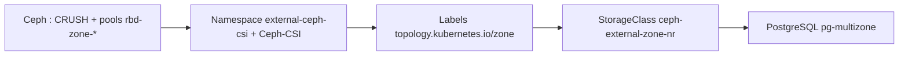

# Déploiement Ceph-CSI RBD avec topologie (zones)

Guide consolidé pour **pg-multizone** — Option D : Ceph externe + driver `rbd.csi.ceph.com` sur OpenShift.

> **Guide pas à pas (référence principale, en anglais)** : [`External-Ceph-Cluster.md`](External-Ceph-Cluster.md)  
> Ce document résume l’architecture et renvoie vers les manifests et scripts du dépôt. Il ne duplique pas les procédures détaillées (bootstrap Ceph, PSA, SCC, etc.).

---

## Objectif

Provisionner des volumes RBD **ancrés par zone** : un pod planifié en `zone-a` reçoit un volume dans le pool `rbd-zone-a`, etc.

Ce n’est **pas** un pool unique répliqué sur 3 zones (`size 3`, règle CRUSH `default zone`). C’est **un pool par zone** avec `size 1` (lab uniquement).

---

## Où la topologie est définie

| Couche | Élément | Valeurs (défaut) | Fichier / étape |
|--------|---------|------------------|-----------------|
| Ceph CRUSH | buckets | `zone-a`, `zone-b`, `zone-c` | [F.6 / Step 1.2](External-Ceph-Cluster.md#f6-configure-crush-zones) |
| Ceph | pools RBD | `rbd-zone-a`, `rbd-zone-b`, `rbd-zone-c` | [F.7 / Step 1.3](External-Ceph-Cluster.md#f7-create-per-zone-rbd-pools) |
| OpenShift | label nœud | `topology.kubernetes.io/zone=zone-a` … | [`topology/zones.env`](runbooks/openshift/topology/zones.env), [Step 3](External-Ceph-Cluster.md#step-3--label-openshift-nodes) |
| ConfigMap | `ceph-csi-config` | `clusterID` + `monitors` **uniquement** | [Step 2.3](External-Ceph-Cluster.md#23-cluster-configmap) — **pas de zones** |
| StorageClass | `topologyConstrainedPools` | `rbd-zone-a` ↔ `zone-a` … | [`storageclass-ceph-external-zone-nr.yaml`](runbooks/openshift/manifests/storageclass-ceph-external-zone-nr.yaml) |
| StorageClass | `allowedTopologies` | `zone-a`, `zone-b`, `zone-c` | idem |
| StatefulSet | affinité zone | `zone-a` … `zone-c` | [`statefulset-external-rbd-nr.yaml`](runbooks/openshift/manifests/statefulset-external-rbd-nr.yaml) |

Source canonique des noms de zones : [`runbooks/openshift/topology/zones.env`](runbooks/openshift/topology/zones.env).

---

## Parcours de déploiement (résumé)



| Étape | Où | Référence |
|-------|-----|-----------|
| 1 | Nœuds Ceph | [Fresh install F.1–F.9](External-Ceph-Cluster.md#fresh-install--ceph-on-3-linux-nodes) ou [Step 1 cluster existant](External-Ceph-Cluster.md#step-1--ceph-per-zone-pools-on-an-existing-cluster) |
| 2 | OpenShift + admin Ceph | [Step 2 — Ceph-CSI](External-Ceph-Cluster.md#step-2--deploy-ceph-csi-separate-from-odf) |
| 3 | OpenShift | `./02-label-nodes.sh` |
| 4 | OpenShift | `oc apply -f manifests/storageclass-ceph-external-zone-nr.yaml` |
| 5–7 | OpenShift | Test PVC, PostgreSQL, vérification |

---

## Driver CSI RBD — ce qui est déployé

Le dépôt **ne contient pas** le manifest `CSIDriver`. Il est appliqué depuis **Ceph-CSI upstream** (Step 2.2) :

| Manifest upstream | Rôle |
|-------------------|------|
| `csidriver.yaml` | Enregistre `rbd.csi.ceph.com` |
| `csi-provisioner-rbac.yaml` | RBAC provisioner |
| `csi-nodeplugin-rbac.yaml` | RBAC node plugin |
| `csi-rbdplugin-provisioner.yaml` | Deployment controller |
| `csi-rbdplugin.yaml` | DaemonSet node |

Namespace : `external-ceph-csi` (pas `ceph-csi-rbd`).

OpenShift requiert en plus : labels PSA `privileged`, SCC sur `rbd-csi-provisioner` et `rbd-csi-nodeplugin` — voir [Step 2.1 et 2.4](External-Ceph-Cluster.md#step-2--deploy-ceph-csi-separate-from-odf).

**Alternative Helm** : possible, mais non documentée pas à pas ici ; aligner `namespaceOverride`, ConfigMap (`clusterID` + moniteurs) et secrets sur [Step 2](External-Ceph-Cluster.md#step-2--deploy-ceph-csi-separate-from-odf).

---

## StorageClass — format correct (Ceph-CSI actuel)

Ne pas utiliser l’ancien paramètre `topology:` (obsolète). Utiliser `topologyConstrainedPools` + `allowedTopologies` + `volumeBindingMode: WaitForFirstConsumer`.

Manifeste du dépôt : [`runbooks/openshift/manifests/storageclass-ceph-external-zone-nr.yaml`](runbooks/openshift/manifests/storageclass-ceph-external-zone-nr.yaml)

```yaml
parameters:
  clusterID: ceph-external          # identique au ConfigMap Step 2.3
  pool: rbd-zone-a                  # pool par défaut ; la topologie choisit le bon
  topologyConstrainedPools: |-
    [
      {"poolName":"rbd-zone-a","domainSegments":[{"domainLabel":"topology.kubernetes.io/zone","value":"zone-a"}]},
      {"poolName":"rbd-zone-b","domainSegments":[{"domainLabel":"topology.kubernetes.io/zone","value":"zone-b"}]},
      {"poolName":"rbd-zone-c","domainSegments":[{"domainLabel":"topology.kubernetes.io/zone","value":"zone-c"}]}
    ]
allowedTopologies:
  - matchLabelExpressions:
      - key: topology.kubernetes.io/zone
        values: [zone-a, zone-b, zone-c]
volumeBindingMode: WaitForFirstConsumer
```

> `clusterID` dans la StorageClass est un **identifiant logique** (`ceph-external`) qui doit correspondre au ConfigMap — ce n’est pas forcément le `ceph fsid`.

---

## Commandes utiles

### Labels de zone (OpenShift)

```bash
cd runbooks/openshift
./02-label-nodes.sh
./topology/verify-alignment.sh
oc get nodes -L topology.kubernetes.io/zone
```

### Vérification Ceph (nœud admin)

```bash
bash runbooks/openshift/topology/verify-ceph-topology.sh
ceph osd tree
ceph osd pool ls | grep rbd-zone
```

### Driver CSI

```bash
oc get csidriver rbd.csi.ceph.com
oc -n external-ceph-csi get pods
```

### Test zone-local (résumé)

PVC + Pod avec `nodeSelector: topology.kubernetes.io/zone: zone-a` — détail dans [Step 5](External-Ceph-Cluster.md#step-5--test-zone-local-provisioning).

---

## Dépannage

| Symptôme | Cause probable | Action |
|----------|----------------|--------|
| `csidriver rbd.csi.ceph.com` NotFound | `csidriver.yaml` non appliqué | [Step 2.2](External-Ceph-Cluster.md#22-install-ceph-csi-latest-compatible-release) |
| CSI CrashLoop | PSA / SCC manquants | [Step 2.1, 2.4](External-Ceph-Cluster.md#step-2--deploy-ceph-csi-separate-from-odf) |
| `no available topology found` | Labels ≠ StorageClass | `./topology/verify-alignment.sh` |
| PVC Pending | `WaitForFirstConsumer` | Créer un Pod avec `nodeSelector` zone |
| `Error EINVAL: unknown type zone-a` | Syntaxe CRUSH rule | [F.7](External-Ceph-Cluster.md#f7-create-per-zone-rbd-pools) — type `host`, pas le nom du bucket |
| Volume dans la mauvaise zone | Pools ou labels incohérents | Vérifier `zones.env`, Ceph et manifests |
| `ceph osd tree` incohérent | Hôtes sous `default` au lieu de `zone-*` | `ceph osd crush move` ; sinon [F.6a crushtool](External-Ceph-Cluster.md#f6a-debug--manual-crush-inspection-via-crushtool-advanced) |

Table complète : [Troubleshooting](External-Ceph-Cluster.md#troubleshooting) dans `External-Ceph-Cluster.md`.

---

## Ce qui a été retiré de ce document

Les versions précédentes concaténaient plusieurs brouillons en double :

- Runbook « pool unique multi-zone » (`rbd-multizone-3zones`, `size 3`) — **hors scope** pg-multizone (zone-local NR).
- Édition manuelle CRUSH via `crushtool` — **debug uniquement** : [F.6a](External-Ceph-Cluster.md#f6a-debug--manual-crush-inspection-via-crushtool-advanced) dans le guide principal (procédure normale : `add-bucket` / `move`).
- Paramètre StorageClass `topology:` — **obsolète** ; remplacé par `topologyConstrainedPools`.
- Sections Helm / `clusterID` = `ceph fsid` répétées 3 fois — voir [Step 2](External-Ceph-Cluster.md#step-2--deploy-ceph-csi-separate-from-odf) pour la méthode manifests (recommandée ici).
- Namespace `ceph-csi-rbd` / `default` — ce projet utilise `external-ceph-csi`.

---

## Voir aussi

| Document | Contenu |
|----------|---------|
| [`External-Ceph-Cluster.md`](External-Ceph-Cluster.md) | Guide end-to-end (Ceph + CSI + OpenShift) |
| [`README.md`](README.md) | Vue d’ensemble des 4 backends stockage |
| [`runbooks/openshift/ZONE-LOCAL-RBD.md`](runbooks/openshift/ZONE-LOCAL-RBD.md) | Zone-local via ODF (Option C), pas Ceph externe |
| [`runbooks/openshift/topology/zones.env`](runbooks/openshift/topology/zones.env) | Noms de zones canoniques |
