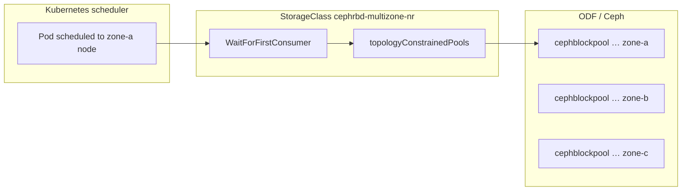

# True zone-local RBD volumes on OpenShift Data Foundation

This guide explains how to provision **RBD volumes in the same availability zone as the pod** using ODF non-resilient (replica-1) topology pools and `WaitForFirstConsumer`.

> **Not the same as pod zone spread**  
> Labeling nodes `zone-a` / `zone-b` / `zone-c` and using a standard RBD StorageClass only spreads **pods**.  
> Volumes still land in the shared `ocs-storagecluster-cephblockpool` unless you complete the steps below.

---

## How it works



1. A pod is scheduled to a node in `zone-a`.
2. The PVC uses `volumeBindingMode: WaitForFirstConsumer` — provisioning waits for that pod.
3. The RBD CSI driver reads the node topology and picks the **zone-a pool** from `topologyConstrainedPools`.
4. The RBD image is created only in that zone's Ceph block pool.

---

## Prerequisites

| Requirement | Why |
|-------------|-----|
| ODF **4.16+** (4.15+ dev preview for multi-AZ) | Non-resilient topology pools |
| **OSDs in each zone** | One replica per zone needs storage in that zone |
| Nodes labeled `topology.kubernetes.io/zone` | Failure domain detection |
| StorageCluster **not** using `flexibleScaling` with `failureDomain: host` only | Host-level pools cannot pin to zones (see [diagnosis](#0--diagnose-your-cluster)) |
| Application accepts **replica-1 risk** | OSD loss in a zone = **guaranteed data loss** for volumes in that pool |

---

## 0 — Diagnose your cluster

Run these before changing anything:

```bash
# RBD CSI driver
oc get csidriver openshift-storage.rbd.csi.ceph.com

# Current block pools and failure domain
oc get cephblockpool -n openshift-storage

# StorageCluster topology settings
oc get storagecluster ocs-storagecluster -n openshift-storage -o yaml \
  | grep -E 'flexibleScaling|failureDomain|cephNonResilientPools|arbiter'

# Node zone labels (storage nodes matter most)
oc get nodes -L topology.kubernetes.io/zone

# Existing topology-aware SC (created by ODF when ready)
oc get storageclass ocs-storagecluster-ceph-non-resilient-rbd 2>/dev/null || echo "not found"
```

### Interpret the results

**Your cluster today** (from typical `host`-only output):

```
ocs-storagecluster-cephblockpool   Ready   Replicated   host
```

This means Ceph spreads replicas by **host**, not zone. The topology template in this repo **will not work** until ODF creates per-zone replica-1 pools.

**Check `flexibleScaling`:**

```bash
oc get storagecluster ocs-storagecluster -n openshift-storage \
  -o jsonpath='flexibleScaling={.spec.flexibleScaling}{"\n"}status.failureDomain={.status.failureDomain}{"\n"}'
```

If `flexibleScaling=true` or `failureDomain=host`, zone-level non-resilient pools are **not supported without redeploying ODF** with zone topology at install time. See [Red Hat: ODF topology considerations](https://developers.redhat.com/articles/2024/06/19/red-hat-openshift-data-foundation-topology-considerations).

**Example — blocked profile** (`flexibleScaling: true`, `failureDomainKey: kubernetes.io/hostname`):

```
flexibleScaling: true
failureDomain: host
failureDomainKey: kubernetes.io/hostname
cephNonResilientPools: {}          # not enabled
ocs-storagecluster-ceph-non-resilient-rbd → not found
```

Cluster-specific walkthrough: [`exchange/SOLUTION-ZONAL-RBD.md`](../../exchange/SOLUTION-ZONAL-RBD.md).

**Green light** — you can proceed when:

- Nodes span **≥ 3 zones** with `topology.kubernetes.io/zone` set
- OSD pods run in each zone
- After enabling non-resilient pools (step 2), `oc get cephblockpool` shows pools with `FAILUREDOMAIN: zone` (names often include the zone value)

---

## 1 — Label nodes with zones

Label **all worker nodes** (especially ODF storage nodes) before enabling non-resilient pools.

This runbook uses synthetic zones — adapt to your real cloud zones if needed:

```bash
./02-label-nodes.sh
```

Or set real AZ labels, e.g. `topology.kubernetes.io/zone=us-east-1a`.

Verify:

```bash
oc get nodes -L topology.kubernetes.io/zone
```

> **Important:** `domainSegments` in the StorageClass must use the **same label key and values** as your nodes. If nodes use `us-east-1a` instead of `zone-a`, update [`manifests/storageclass-cephrbd-multizone-nr.yaml`](manifests/storageclass-cephrbd-multizone-nr.yaml) accordingly.

---

## 2 — Enable ODF non-resilient (per-zone) block pools

ODF creates one **replica-1** `CephBlockPool` per failure domain (zone) and a matching StorageClass.

```bash
oc patch storagecluster ocs-storagecluster -n openshift-storage --type json \
  --patch '[{"op": "replace", "path": "/spec/managedResources/cephNonResilientPools/enable", "value": true}]'
```

Wait until new pools are `Ready` (can take several minutes):

```bash
watch oc get cephblockpool -n openshift-storage
```

Expected — **additional** pools per zone, for example:

```
NAME                                                    PHASE   TYPE         FAILUREDOMAIN
ocs-storagecluster-cephblockpool                        Ready   Replicated   host
ocs-storagecluster-cephblockpool-zone-a                 Ready   Replicated   zone
ocs-storagecluster-cephblockpool-zone-b                 Ready   Replicated   zone
ocs-storagecluster-cephblockpool-zone-c                 Ready   Replicated   zone
```

Pool names vary (`…-us-east-1a`, `…-worker-0`, etc.). Use actual names from your cluster in step 3.

Verify ODF created the topology StorageClass:

```bash
oc get storageclass ocs-storagecluster-ceph-non-resilient-rbd -o yaml
```

Note `volumeBindingMode: WaitForFirstConsumer` and the `topologyConstrainedPools` JSON — you will reuse it.

---

## 3 — Create `cephrbd-multizone-nr` StorageClass

### Option A — Clone ODF's class (recommended)

```bash
oc get storageclass ocs-storagecluster-ceph-non-resilient-rbd -o yaml \
  | sed 's/name: ocs-storagecluster-ceph-non-resilient-rbd/name: cephrbd-multizone-nr/' \
  | oc apply -f -
```

### Option B — Edit the topology template

1. Copy `topologyConstrainedPools` from `ocs-storagecluster-ceph-non-resilient-rbd`.
2. Edit [`manifests/storageclass-cephrbd-multizone-nr.yaml`](manifests/storageclass-cephrbd-multizone-nr.yaml).
3. Replace `<CLUSTER_ID>`, `<POOL>`, `<POOL_ZONE_*>` and align `domainSegments` with your node labels.

```bash
oc apply -f manifests/storageclass-cephrbd-multizone-nr.yaml
```

Verify:

```bash
oc get storageclass cephrbd-multizone-nr -o yaml
```

Must have:

- `provisioner: openshift-storage.rbd.csi.ceph.com`
- `volumeBindingMode: WaitForFirstConsumer`
- `topologyConstrainedPools` — one entry per zone
- `allowedTopologies` matching node zone labels

---

## 4 — Test zone-local provisioning

PVC stays `Pending` until a consuming pod is scheduled (`WaitForFirstConsumer`):

```bash
oc create namespace sc-test --dry-run=client -o yaml | oc apply -f -

cat <<'EOF' | oc apply -f -
apiVersion: v1
kind: PersistentVolumeClaim
metadata:
  name: test-zone-a
  namespace: sc-test
spec:
  accessModes: [ReadWriteOnce]
  storageClassName: cephrbd-multizone-nr
  resources:
    requests:
      storage: 1Gi
---
apiVersion: v1
kind: Pod
metadata:
  name: test-zone-a
  namespace: sc-test
spec:
  nodeSelector:
    topology.kubernetes.io/zone: zone-a    # match your zone label
  containers:
  - name: pause
    image: registry.access.redhat.com/ubi9/ubi-minimal
    command: ["sleep", "infinity"]
    volumeMounts:
    - name: data
      mountPath: /data
  volumes:
  - name: data
    persistentVolumeClaim:
      claimName: test-zone-a
EOF

oc get pvc -n sc-test
oc describe pvc test-zone-a -n sc-test   # check Events
```

**Success:** PVC `Bound`, and the provisioned volume uses the pool mapped to `zone-a` in `topologyConstrainedPools`.

Repeat with `zone-b` / `zone-c` nodeSelectors to confirm each zone gets its own pool.

```bash
oc delete namespace sc-test
```

---

## 5 — Deploy PostgreSQL

```bash
./deploy-rbd-nr.sh
# or
./03-deploy-postgres.sh cephrbd
```

The StatefulSet ([`manifests/statefulset-rbd-nr.yaml`](manifests/statefulset-rbd-nr.yaml)) uses `cephrbd-multizone-nr`. With `WaitForFirstConsumer`, each `postgres-N` PVC should provision in the zone where that pod is scheduled.

Verify:

```bash
oc get pod -n pg-multizone -o wide
oc get pvc -n pg-multizone
```

---

## Risks and trade-offs

| Topic | Detail |
|-------|--------|
| **Replica 1** | No Ceph replication inside the zone. Application must handle HA (e.g. 3 independent DBs, or Patroni). |
| **OSD failure** | Data in that zone's pool is **lost**. Red Hat documents disruptive recovery — see [ODF storage classes — replica 1 recovery](https://docs.redhat.com/en/documentation/red_hat_openshift_data_foundation/4.21/html/managing_and_allocating_storage_resources/storage-classes_rhodf). |
| **Disable feature** | Delete workloads → set `cephNonResilientPools/enable: false` → delete replica-1 pools. |
| **vs resilient RBD** | Default `ocs-storagecluster-ceph-rbd` replicates across the cluster — survives OSD loss but is **not** zone-local. |

---

## Troubleshooting

| Symptom | Likely cause | Action |
|---------|--------------|--------|
| Only `host` failure domain pools | `flexibleScaling` or no zone labels at ODF install | Review StorageCluster; may need ODF redeploy with zone topology |
| Patch has no effect / no new pools | Nodes lack zone labels or OSDs not in each zone | Fix labels; ensure storage nodes per zone |
| `no available topology found` | `allowedTopologies` / `domainSegments` mismatch node labels | Align SC with `oc get nodes -L topology.kubernetes.io/zone` |
| PVC pending forever | No pod consuming PVC (`WaitForFirstConsumer`) | Create pod or check StatefulSet scheduling |
| `ocs-storagecluster-ceph-non-resilient-rbd` missing | Feature not enabled or pools not Ready | Re-check step 2; inspect `oc get storagecluster -o yaml` events |

Useful commands:

```bash
oc get events -n openshift-storage --sort-by='.lastTimestamp' | tail -20
oc describe pvc <name> -n pg-multizone
oc get storageclass cephrbd-multizone-nr -o jsonpath='{.parameters.topologyConstrainedPools}' | jq .
```

---

## Disable and rollback

```bash
# 1. Delete workloads using cephrbd-multizone-nr
oc delete namespace pg-multizone

# 2. Disable non-resilient pools on StorageCluster
oc patch storagecluster ocs-storagecluster -n openshift-storage --type json \
  --patch '[{"op": "replace", "path": "/spec/managedResources/cephNonResilientPools/enable", "value": false}]'

# 3. Remove custom StorageClass
oc delete storageclass cephrbd-multizone-nr
```

---

## Related docs

- [`STORAGECLASS-RBD.md`](STORAGECLASS-RBD.md) — simple vs topology StorageClass paths
- [`STORAGECLASS.md`](STORAGECLASS.md) — CephFS path (no zone-local volumes)
- [Red Hat ODF — storage classes (replica 1)](https://docs.redhat.com/en/documentation/red_hat_openshift_data_foundation/4.21/html/managing_and_allocating_storage_resources/storage-classes_rhodf)
- [Red Hat ODF topology considerations](https://developers.redhat.com/articles/2024/06/19/red-hat-openshift-data-foundation-topology-considerations)
- [ODF multi-AZ with Multus](https://developers.redhat.com/learn/openshift/deploy-openshift-data-foundation-across-availability-zones-using-multus)
